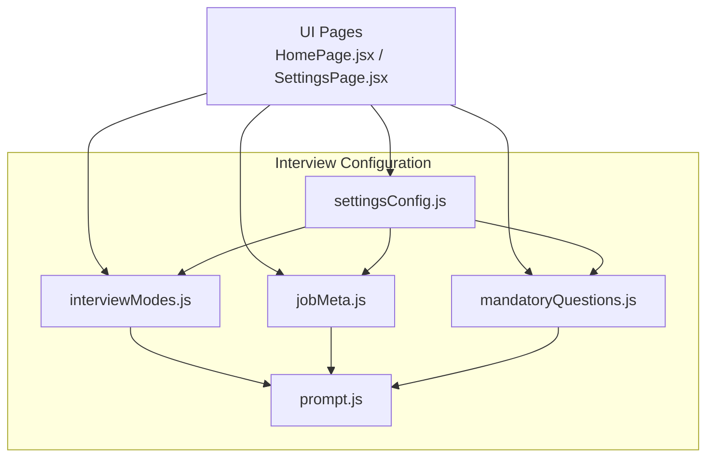
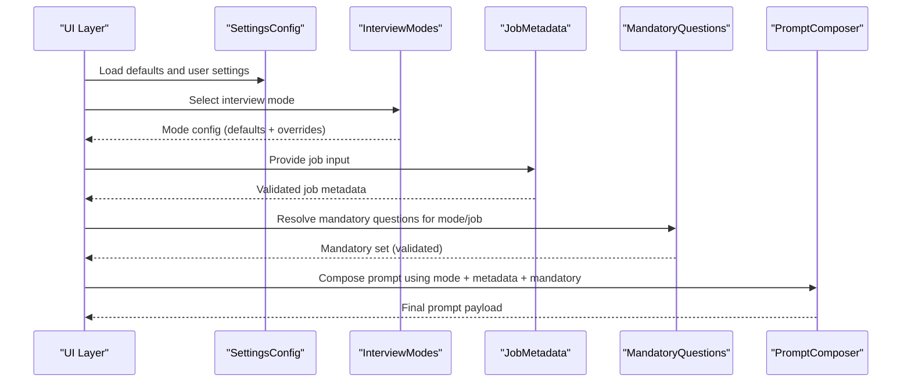
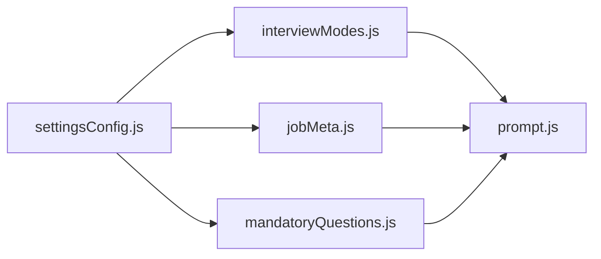

# Interview Configuration

<cite>
**Referenced Files in This Document**
- [interviewModes.js](file://src/lib/interviewModes.js)
- [jobMeta.js](file://src/lib/jobMeta.js)
- [mandatoryQuestions.js](file://src/lib/mandatoryQuestions.js)
- [settingsConfig.js](file://src/lib/settingsConfig.js)
- [prompt.js](file://src/lib/prompt.js)
</cite>

## Table of Contents
1. [Introduction](#introduction)
2. [Project Structure](#project-structure)
3. [Core Components](#core-components)
4. [Architecture Overview](#architecture-overview)
5. [Detailed Component Analysis](#detailed-component-analysis)
6. [Dependency Analysis](#dependency-analysis)
7. [Performance Considerations](#performance-considerations)
8. [Troubleshooting Guide](#troubleshooting-guide)
9. [Conclusion](#conclusion)
10. [Appendices](#appendices)

## Introduction
This document explains LineCheck’s interview configuration utilities, focusing on:
- The interview modes system and how to configure different interview types
- Job metadata handling and schema extension
- Mandatory questions management and rule configuration
- Dynamic question generation integration points
- Validation rules, default configurations, and extensibility patterns

The goal is to help you add new interview modes, extend job metadata schemas, configure mandatory question rules, and integrate with the question generation engine safely and consistently.

## Project Structure
The interview configuration utilities are implemented under src/lib and include:
- Interview modes registry and runtime selection
- Job metadata schema and defaults
- Mandatory questions configuration and validation
- Settings configuration for persistence and defaults
- Prompt composition helpers used by the question generation engine

**Diagram sources**
- [interviewModes.js](file://src/lib/interviewModes.js)
- [jobMeta.js](file://src/lib/jobMeta.js)
- [mandatoryQuestions.js](file://src/lib/mandatoryQuestions.js)
- [settingsConfig.js](file://src/lib/settingsConfig.js)
- [prompt.js](file://src/lib/prompt.js)

**Section sources**
- [interviewModes.js](file://src/lib/interviewModes.js)
- [jobMeta.js](file://src/lib/jobMeta.js)
- [mandatoryQuestions.js](file://src/lib/mandatoryQuestions.js)
- [settingsConfig.js](file://src/lib/settingsConfig.js)
- [prompt.js](file://src/lib/prompt.js)

## Core Components
- Interview Modes System
  - Provides a registry of supported interview modes and their behaviors
  - Exposes functions to select, validate, and resolve mode-specific settings
  - Integrates with settings to load defaults and user overrides
- Job Metadata Handling
  - Defines the job metadata schema, defaults, and validators
  - Normalizes incoming job data and ensures required fields are present
  - Supports extension points for custom fields and validations
- Mandatory Questions Management
  - Configures which questions must be asked per mode or job
  - Enforces coverage rules and prevents duplicates
  - Integrates with prompt composition to ensure mandatory items are included
- Settings Configuration
  - Centralizes default configurations and persisted settings
  - Merges defaults with user preferences and environment values
  - Provides getters/setters for consistent access across modules
- Prompt Composition
  - Builds prompts from selected mode, job metadata, and mandatory questions
  - Applies dynamic generation hooks and constraints

**Section sources**
- [interviewModes.js](file://src/lib/interviewModes.js)
- [jobMeta.js](file://src/lib/jobMeta.js)
- [mandatoryQuestions.js](file://src/lib/mandatoryQuestions.js)
- [settingsConfig.js](file://src/lib/settingsConfig.js)
- [prompt.js](file://src/lib/prompt.js)

## Architecture Overview
The configuration system composes three primary inputs—interview mode, job metadata, and mandatory questions—into a validated configuration object that drives prompt generation.

**Diagram sources**
- [interviewModes.js](file://src/lib/interviewModes.js)
- [jobMeta.js](file://src/lib/jobMeta.js)
- [mandatoryQuestions.js](file://src/lib/mandatoryQuestions.js)
- [settingsConfig.js](file://src/lib/settingsConfig.js)
- [prompt.js](file://src/lib/prompt.js)

## Detailed Component Analysis

### Interview Modes System
Responsibilities:
- Define available interview modes and their capabilities
- Resolve mode-specific defaults and constraints
- Validate mode selection against configured options
- Integrate with settings to support user overrides

Extensibility:
- Add a new mode by registering it in the modes registry
- Provide defaults, allowed parameters, and validation rules
- Ensure compatibility with mandatory questions and prompt composition

Validation:
- Reject unknown modes
- Enforce presence of required mode parameters
- Merge user overrides with defaults safely

Integration:
- Supplies resolved mode configuration to prompt composer
- Works with settings to persist user-selected mode

**Section sources**
- [interviewModes.js](file://src/lib/interviewModes.js)
- [settingsConfig.js](file://src/lib/settingsConfig.js)

#### Adding a New Interview Mode
Steps:
- Register the new mode in the modes registry
- Define default parameters and constraints
- Implement validation for required fields
- Ensure mandatory questions can reference the new mode
- Update settings defaults if needed

**Section sources**
- [interviewModes.js](file://src/lib/interviewModes.js)
- [mandatoryQuestions.js](file://src/lib/mandatoryQuestions.js)
- [settingsConfig.js](file://src/lib/settingsConfig.js)

### Job Metadata Handling
Responsibilities:
- Define the job metadata schema and defaults
- Normalize and validate incoming job data
- Support extension points for custom fields
- Provide safe accessors for downstream components

Schema Extension:
- Extend the schema to include additional job-specific fields
- Add field-level validators and default values
- Ensure backward compatibility when adding optional fields

Validation Rules:
- Required fields must be present and non-empty
- Type checks and format constraints enforced
- Custom validators can be registered for domain-specific rules

Defaults:
- Provide sensible defaults for optional fields
- Allow settings to override defaults at runtime

**Section sources**
- [jobMeta.js](file://src/lib/jobMeta.js)
- [settingsConfig.js](file://src/lib/settingsConfig.js)

#### Extending Job Metadata Schema
Steps:
- Add new fields to the schema definition
- Define default values and validators
- Update normalization logic to handle new fields
- Ensure prompt composition uses extended fields where appropriate

**Section sources**
- [jobMeta.js](file://src/lib/jobMeta.js)
- [prompt.js](file://src/lib/prompt.js)

### Mandatory Questions Management
Responsibilities:
- Configure mandatory questions per interview mode and job context
- Enforce coverage rules and prevent duplicates
- Integrate with prompt composition to guarantee inclusion

Rule Configuration:
- Specify which questions are mandatory for each mode
- Apply job-specific overrides when applicable
- Validate that mandatory sets are resolvable and unique

Coverage and Deduplication:
- Ensure all mandatory questions are included exactly once
- Detect and report conflicts or missing references

Integration:
- Supplies mandatory question IDs to the prompt composer
- Works with interview modes to scope mandatory lists

**Section sources**
- [mandatoryQuestions.js](file://src/lib/mandatoryQuestions.js)
- [interviewModes.js](file://src/lib/interviewModes.js)
- [prompt.js](file://src/lib/prompt.js)

#### Configuring Mandatory Question Rules
Steps:
- Define mandatory question mappings for each mode
- Add job-specific overrides if necessary
- Validate the final mandatory set for completeness and uniqueness
- Confirm prompt composition includes all mandatory items

**Section sources**
- [mandatoryQuestions.js](file://src/lib/mandatoryQuestions.js)
- [prompt.js](file://src/lib/prompt.js)

### Settings Configuration
Responsibilities:
- Centralize default configurations and persisted settings
- Merge defaults with user preferences and environment values
- Provide consistent getters/setters for other modules

Default Overrides:
- Allow environment or admin overrides for critical defaults
- Maintain backward compatibility when changing defaults

Persistence:
- Persist user-selected mode, job metadata, and mandatory rules
- Sync changes across components via settings updates

**Section sources**
- [settingsConfig.js](file://src/lib/settingsConfig.js)
- [interviewModes.js](file://src/lib/interviewModes.js)
- [jobMeta.js](file://src/lib/jobMeta.js)
- [mandatoryQuestions.js](file://src/lib/mandatoryQuestions.js)

### Prompt Composition Integration
Responsibilities:
- Build prompts using resolved mode, job metadata, and mandatory questions
- Apply dynamic generation hooks and constraints
- Ensure output conforms to expected structure for downstream processing

Dynamic Generation:
- Use job metadata to tailor question content
- Respect mandatory questions and mode-specific constraints
- Provide extension points for custom prompt segments

**Section sources**
- [prompt.js](file://src/lib/prompt.js)
- [interviewModes.js](file://src/lib/interviewModes.js)
- [jobMeta.js](file://src/lib/jobMeta.js)
- [mandatoryQuestions.js](file://src/lib/mandatoryQuestions.js)

## Dependency Analysis
High-level dependencies among configuration modules:

**Diagram sources**
- [settingsConfig.js](file://src/lib/settingsConfig.js)
- [interviewModes.js](file://src/lib/interviewModes.js)
- [jobMeta.js](file://src/lib/jobMeta.js)
- [mandatoryQuestions.js](file://src/lib/mandatoryQuestions.js)
- [prompt.js](file://src/lib/prompt.js)

**Section sources**
- [settingsConfig.js](file://src/lib/settingsConfig.js)
- [interviewModes.js](file://src/lib/interviewModes.js)
- [jobMeta.js](file://src/lib/jobMeta.js)
- [mandatoryQuestions.js](file://src/lib/mandatoryQuestions.js)
- [prompt.js](file://src/lib/prompt.js)

## Performance Considerations
- Cache resolved mode configurations and mandatory question sets to avoid recomputation
- Defer heavy validations until necessary (e.g., before prompt composition)
- Minimize deep merges by applying targeted overrides
- Keep job metadata normalization efficient by validating only changed fields

[No sources needed since this section provides general guidance]

## Troubleshooting Guide
Common issues and resolutions:
- Unknown interview mode error
  - Verify the mode exists in the registry and is enabled in settings
  - Check for typos in mode identifiers
- Missing job metadata fields
  - Ensure required fields are provided and pass validation
  - Review default values and schema extensions
- Mandatory questions not included
  - Confirm mandatory mappings exist for the selected mode
  - Check for duplicate IDs or unresolved references
- Settings not applied
  - Validate persistence layer and merge order
  - Ensure user overrides are correctly loaded

**Section sources**
- [interviewModes.js](file://src/lib/interviewModes.js)
- [jobMeta.js](file://src/lib/jobMeta.js)
- [mandatoryQuestions.js](file://src/lib/mandatoryQuestions.js)
- [settingsConfig.js](file://src/lib/settingsConfig.js)

## Conclusion
LineCheck’s interview configuration utilities provide a robust foundation for defining interview modes, managing job metadata, enforcing mandatory questions, and composing prompts dynamically. By following the extensibility patterns and validation rules outlined here, you can safely add new modes, extend schemas, and integrate with the question generation engine while maintaining consistency and reliability.

[No sources needed since this section summarizes without analyzing specific files]

## Appendices

### Quick Reference: Extensibility Patterns
- Adding an interview mode
  - Register mode, define defaults, implement validation, update settings
- Extending job metadata
  - Add fields to schema, set defaults and validators, normalize input
- Configuring mandatory questions
  - Map mandatory sets per mode/job, enforce uniqueness and coverage
- Integrating with prompt composition
  - Use resolved mode, metadata, and mandatory set; apply dynamic hooks

**Section sources**
- [interviewModes.js](file://src/lib/interviewModes.js)
- [jobMeta.js](file://src/lib/jobMeta.js)
- [mandatoryQuestions.js](file://src/lib/mandatoryQuestions.js)
- [prompt.js](file://src/lib/prompt.js)
- [settingsConfig.js](file://src/lib/settingsConfig.js)