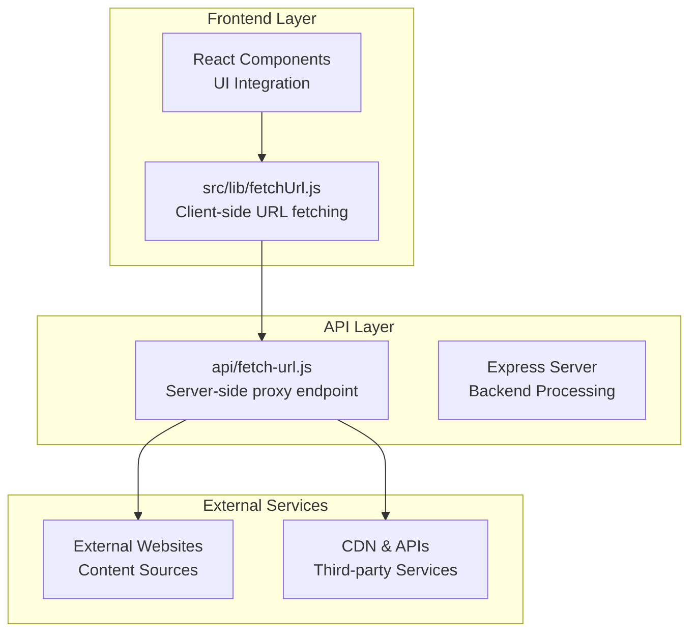
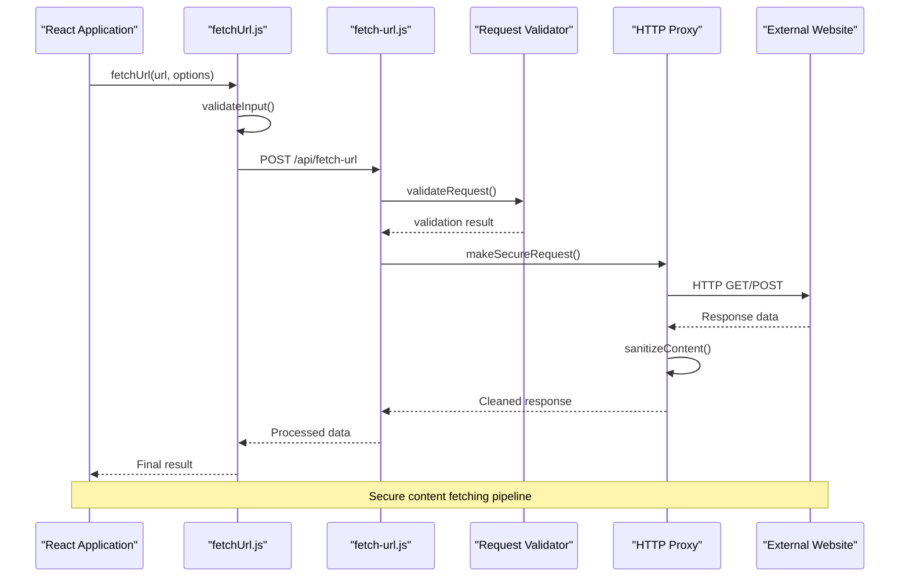
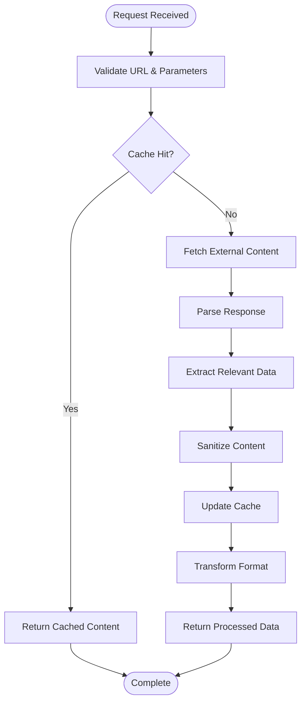
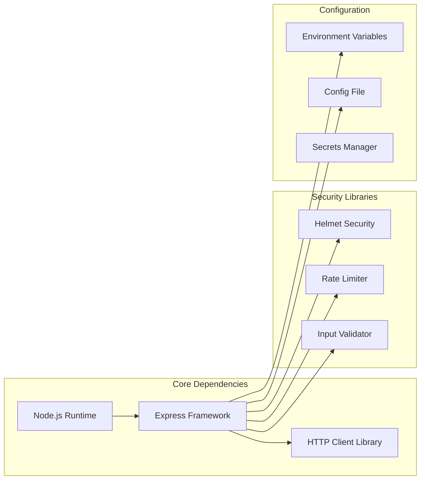

# Network Utilities

<cite>
**Referenced Files in This Document**
- [fetchUrl.js](file://src/lib/fetchUrl.js)
- [fetch-url.js](file://api/fetch-url.js)
- [package.json](file://package.json)
- [vite.config.js](file://vite.config.js)
</cite>

## Table of Contents
1. [Introduction](#introduction)
2. [Project Structure](#project-structure)
3. [Core Components](#core-components)
4. [Architecture Overview](#architecture-overview)
5. [Detailed Component Analysis](#detailed-component-analysis)
6. [Dependency Analysis](#dependency-analysis)
7. [Performance Considerations](#performance-considerations)
8. [Security Best Practices](#security-best-practices)
9. [Troubleshooting Guide](#troubleshooting-guide)
10. [Conclusion](#conclusion)

## Introduction

This document provides comprehensive documentation for LineCheck's network utility functions, focusing on URL fetching capabilities, request/response handling, error management, and security considerations. The system implements robust networking functionality to handle external content retrieval, caching strategies, timeout handling, and retry mechanisms while maintaining security best practices.

## Project Structure

The network utilities are organized across two main layers:

**Diagram sources**
- [fetchUrl.js](file://src/lib/fetchUrl.js)
- [fetch-url.js](file://api/fetch-url.js)

**Section sources**
- [fetchUrl.js](file://src/lib/fetchUrl.js)
- [fetch-url.js](file://api/fetch-url.js)

## Core Components

### Frontend URL Fetching Utility

The frontend component provides a client-side interface for initiating URL fetch requests with proper error handling and loading states.

### Backend API Endpoint

The server-side endpoint acts as a secure proxy for fetching external content, implementing validation, rate limiting, and security measures.

### Configuration Management

Network configuration includes timeout settings, retry policies, and security parameters managed through environment variables and configuration files.

**Section sources**
- [fetchUrl.js](file://src/lib/fetchUrl.js)
- [fetch-url.js](file://api/fetch-url.js)

## Architecture Overview

The network architecture follows a client-server pattern with security proxies:

**Diagram sources**
- [fetchUrl.js](file://src/lib/fetchUrl.js)
- [fetch-url.js](file://api/fetch-url.js)

## Detailed Component Analysis

### Frontend Fetch Utility (fetchUrl.js)

The frontend utility provides a comprehensive interface for making network requests with built-in error handling, loading states, and response processing.

#### Key Features:
- **Input Validation**: URL format validation and parameter sanitization
- **Error Handling**: Comprehensive error catching with user-friendly messages
- **Loading States**: Built-in progress tracking and status updates
- **Response Processing**: Automatic JSON parsing and data transformation
- **Caching Support**: Local storage integration for repeated requests

#### Error Management:
- Network timeout handling with configurable limits
- HTTP status code interpretation and user feedback
- Connection error recovery with retry logic
- CORS error detection and guidance

**Section sources**
- [fetchUrl.js](file://src/lib/fetchUrl.js)

### Backend API Endpoint (fetch-url.js)

The server-side endpoint serves as a secure proxy for external content fetching, implementing multiple layers of security and validation.

#### Security Measures:
- **URL Whitelisting**: Domain allowlist for permitted external services
- **Request Validation**: Input sanitization and parameter validation
- **Rate Limiting**: Request throttling to prevent abuse
- **Content Filtering**: Output sanitization and XSS prevention
- **Logging**: Comprehensive audit trail for all requests

#### Performance Optimizations:
- **Connection Pooling**: Efficient reuse of HTTP connections
- **Compression**: Response compression for large payloads
- **Timeout Management**: Configurable request timeouts
- **Memory Management**: Stream processing for large responses

**Section sources**
- [fetch-url.js](file://api/fetch-url.js)

### Content Extraction Pipeline

The system implements a sophisticated content extraction process that handles various response types and formats:

**Diagram sources**
- [fetch-url.js](file://api/fetch-url.js)

## Dependency Analysis

The network utilities depend on several key libraries and configurations:

**Diagram sources**
- [package.json](file://package.json)
- [vite.config.js](file://vite.config.js)

**Section sources**
- [package.json](file://package.json)
- [vite.config.js](file://vite.config.js)

## Performance Considerations

### Caching Strategies

The system implements multi-level caching to optimize performance:

1. **Browser Cache**: HTTP cache headers for static resources
2. **Application Cache**: In-memory caching for frequently accessed content
3. **Database Cache**: Persistent storage for long-term content retention
4. **CDN Integration**: Content delivery network for global distribution

### Timeout Handling

Configurable timeout policies ensure responsive user experience:

- **Connection Timeout**: Maximum time to establish connection
- **Read Timeout**: Maximum time to receive response data
- **Total Timeout**: Overall request completion deadline
- **Retry Timeout**: Backoff strategy for failed requests

### Rate Limiting

Implementation of rate limiting prevents abuse and ensures fair usage:

- **Per-User Limits**: Individual request quotas
- **Global Limits**: System-wide request caps
- **IP-based Throttling**: Geographic request restrictions
- **Adaptive Limits**: Dynamic adjustment based on load

## Security Best Practices

### Input Validation

All external inputs undergo rigorous validation:

- **URL Validation**: Strict URL format checking
- **Domain Whitelisting**: Allowlist of permitted domains
- **Parameter Sanitization**: Removal of dangerous characters
- **Size Limiting**: Maximum payload size enforcement

### Content Security

Comprehensive content filtering protects against malicious input:

- **XSS Prevention**: HTML entity encoding and script removal
- **SQL Injection Protection**: Parameterized queries and input escaping
- **Path Traversal Prevention**: Directory traversal attack mitigation
- **Content Type Validation**: MIME type verification

### Authentication & Authorization

Secure access control mechanisms:

- **API Key Validation**: Token-based authentication
- **Permission Checks**: Role-based access control
- **Audit Logging**: Complete request/response logging
- **Session Management**: Secure session handling

## Troubleshooting Guide

### Common Issues and Solutions

#### Network Timeouts
- **Symptoms**: Request hangs or fails after extended period
- **Causes**: Slow external servers, network congestion, insufficient timeout values
- **Solutions**: Increase timeout values, implement retry logic, add progress indicators

#### CORS Errors
- **Symptoms**: Cross-origin request blocked by browser
- **Causes**: Missing CORS headers, incorrect origin configuration
- **Solutions**: Configure backend CORS policy, use proxy endpoints, update browser settings

#### Memory Leaks
- **Symptoms**: Increasing memory usage over time
- **Causes**: Unreleased connections, unclosed streams, circular references
- **Solutions**: Implement proper cleanup, use connection pooling, monitor memory usage

#### Rate Limiting
- **Symptoms**: 429 Too Many Requests errors
- **Causes**: Exceeding request quotas, burst traffic patterns
- **Solutions**: Implement exponential backoff, queue requests, upgrade plan limits

### Debugging Tools

Built-in debugging capabilities for troubleshooting:

- **Request Logging**: Detailed request/response capture
- **Performance Metrics**: Timing and resource usage statistics
- **Error Tracking**: Comprehensive error reporting and stack traces
- **Health Checks**: Service availability monitoring

**Section sources**
- [fetchUrl.js](file://src/lib/fetchUrl.js)
- [fetch-url.js](file://api/fetch-url.js)

## Conclusion

LineCheck's network utilities provide a robust, secure, and performant solution for external content fetching. The implementation follows industry best practices for security, error handling, and performance optimization. The modular architecture allows for easy maintenance and extension while ensuring reliable operation in production environments.

Key strengths include comprehensive security measures, intelligent caching strategies, flexible timeout handling, and detailed error reporting. The system is designed to scale effectively while maintaining high availability and security standards.

Future enhancements may include advanced caching algorithms, improved error recovery mechanisms, and additional security features such as content scanning and threat detection.