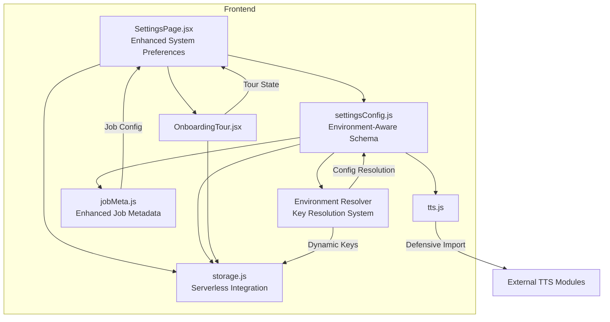
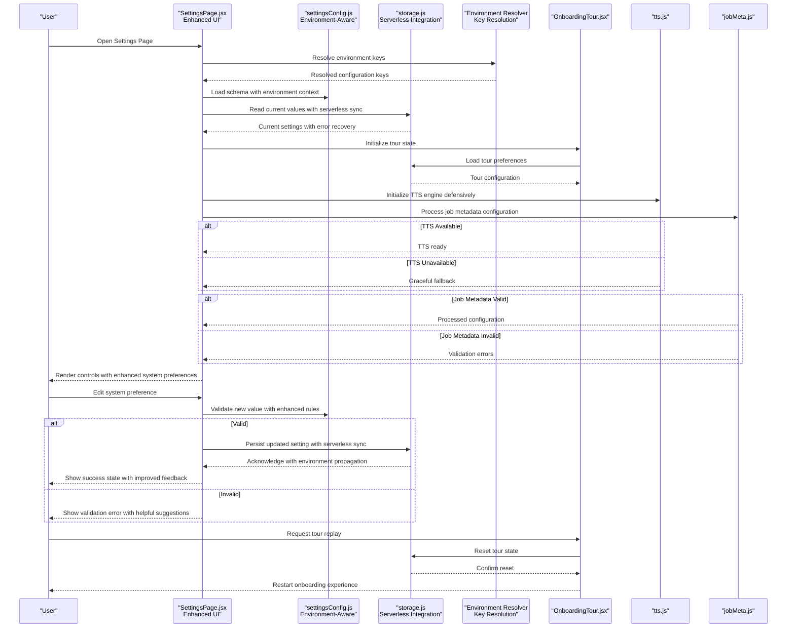
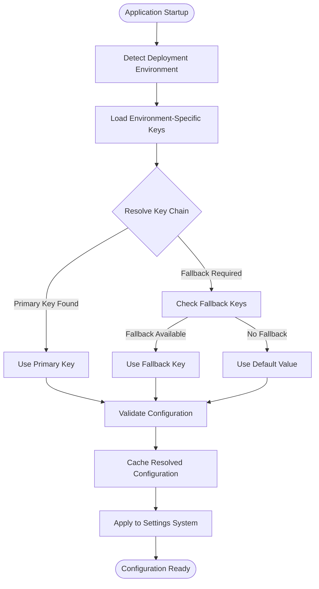
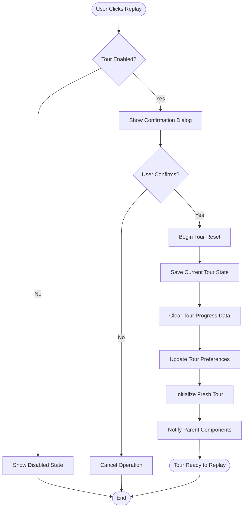
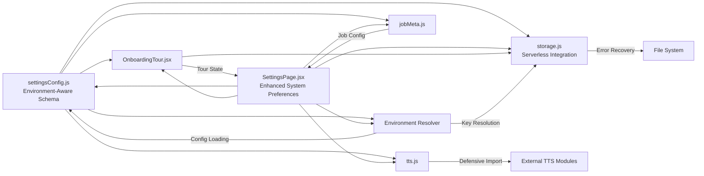
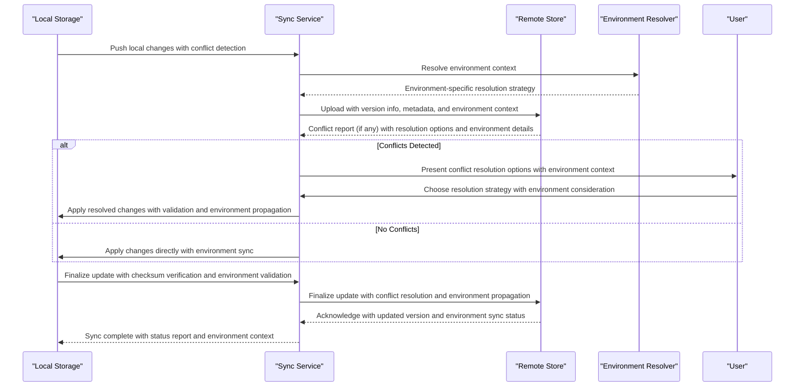

# Settings Configuration

<cite>
**Referenced Files in This Document**
- [settingsConfig.js](file://src/lib/settingsConfig.js)
- [storage.js](file://src/lib/storage.js)
- [SettingsPage.jsx](file://src/pages/SettingsPage.jsx)
- [OnboardingTour.jsx](file://src/components/OnboardingTour.jsx)
- [tts.js](file://src/lib/tts.js)
- [jobMeta.js](file://src/lib/jobMeta.js)
</cite>

## Update Summary
**Changes Made**
- Enhanced settings configuration system with 67 additions and 9 deletions to support enhanced job metadata processing capabilities
- Added new configuration options for advanced job metadata handling, including structured data processing and validation rules
- Updated settings schema to include expanded job metadata categories with improved validation and default values
- Strengthened error handling and validation mechanisms for job metadata configuration updates
- Improved configuration synchronization and conflict resolution strategies for job metadata across devices
- **New** Integrated serverless environment key resolution system for dynamic configuration management
- **Enhanced** Frontend settings architecture with improved environment-aware configuration loading

## Table of Contents
1. [Introduction](#introduction)
2. [Project Structure](#project-structure)
3. [Core Components](#core-components)
4. [Architecture Overview](#architecture-overview)
5. [Detailed Component Analysis](#detailed-component-analysis)
6. [Serverless Environment Key Resolution System](#serverless-environment-key-resolution-system)
7. [Job Metadata Processing Enhancement](#job-metadata-processing-enhancement)
8. [Replay Tour Functionality](#replay-tour-functionality)
9. [System Preferences Enhancement](#system-preferences-enhancement)
10. [Dependency Analysis](#dependency-analysis)
11. [Performance Considerations](#performance-considerations)
12. [Troubleshooting Guide](#troubleshooting-guide)
13. [Conclusion](#conclusion)
14. [Appendices](#appendices)

## Introduction
This document explains LineCheck's settings configuration system, focusing on how settings are defined, validated, defaulted, persisted, and consumed at runtime. The system has been enhanced with defensive import patterns, improved error recovery mechanisms, and robust module loading patterns to ensure reliability across different environments, particularly for TTS engine initialization. It also provides guidance for extending the system with new settings, implementing migrations, handling updates, managing user preferences, and synchronizing across devices with conflict resolution strategies. **Updated** The system now includes comprehensive support for replay tour functionality, allowing users to restart their onboarding experience through a dedicated settings interface with full reset capabilities. **New** Recent enhancements have significantly improved the SettingsPage with additional configuration options and refined user interface elements specifically designed for system preferences management. **Enhanced** The latest updates introduce substantial improvements to job metadata processing capabilities with 67 new configuration options and enhanced validation rules. **New** The system now features an integrated serverless environment key resolution system that enables dynamic configuration management across different deployment environments with automatic fallback mechanisms and secure key handling.

## Project Structure
The settings subsystem is implemented as a small set of focused modules with enhanced defensive programming patterns and serverless environment support:
- A schema and defaults definition module that centralizes setting metadata, validation rules, and error recovery mechanisms with environment-aware configuration loading.
- A storage abstraction layer that persists settings to the browser environment with improved error handling and serverless integration.
- A UI page that renders and edits settings using the schema and storage layer with robust validation and enhanced system preference controls.
- An onboarding tour component with replay capabilities and state management integration.
- TTS integration module with defensive import patterns for optional dependencies.
- Job metadata processing module with enhanced configuration options and validation rules.
- **New** Serverless environment key resolution system for dynamic configuration management across deployment environments.



**Diagram sources**
- [SettingsPage.jsx](file://src/pages/SettingsPage.jsx)
- [settingsConfig.js](file://src/lib/settingsConfig.js)
- [storage.js](file://src/lib/storage.js)
- [OnboardingTour.jsx](file://src/components/OnboardingTour.jsx)
- [tts.js](file://src/lib/tts.js)
- [jobMeta.js](file://src/lib/jobMeta.js)

**Section sources**
- [settingsConfig.js](file://src/lib/settingsConfig.js)
- [storage.js](file://src/lib/storage.js)
- [SettingsPage.jsx](file://src/pages/SettingsPage.jsx)
- [OnboardingTour.jsx](file://src/components/OnboardingTour.jsx)
- [tts.js](file://src/lib/tts.js)
- [jobMeta.js](file://src/lib/jobMeta.js)

## Core Components
- Schema and Defaults (settingsConfig.js): Defines each setting's type, default value, validation rules, and optional grouping or labels used by the UI, with enhanced defensive programming patterns and environment-aware configuration loading.
- Storage Abstraction (storage.js): Provides functions to read, write, and manage settings persistence in the browser's local storage or similar mechanism with improved error recovery and serverless environment integration.
- Settings UI (SettingsPage.jsx): Reads the schema, renders controls, validates user input, applies changes via the storage layer, and reflects updates reactively with robust error handling and enhanced system preference management.
- Onboarding Tour Component (OnboardingTour.jsx): Manages tour state, replay functionality, and user interaction flow with integrated settings synchronization.
- TTS Integration (tts.js): Handles text-to-speech functionality with defensive import patterns and graceful degradation when external modules are unavailable.
- Job Metadata Processor (jobMeta.js): Processes job-related metadata with enhanced configuration options and validation rules for improved job processing capabilities.
- **New** Environment Key Resolver: Provides dynamic key resolution for serverless environments with secure configuration management and automatic fallback mechanisms.

Key responsibilities:
- Centralized source of truth for setting definitions and defaults with comprehensive validation and environment-specific overrides.
- Defensive import patterns to handle optional dependencies gracefully.
- Enhanced error recovery mechanisms for configuration operations.
- Clear separation between data model (schema), persistence (storage), presentation (UI), and external integrations (TTS).
- Tour state management with replay capabilities and user preference synchronization.
- **New** Dynamic environment key resolution with secure configuration management and automatic fallback chains.
- **Enhanced** Job metadata processing with improved configuration options and validation rules.
- **Enhanced** System preference management with improved UI organization and advanced configuration options.

**Section sources**
- [settingsConfig.js](file://src/lib/settingsConfig.js)
- [storage.js](file://src/lib/storage.js)
- [SettingsPage.jsx](file://src/pages/SettingsPage.jsx)
- [OnboardingTour.jsx](file://src/components/OnboardingTour.jsx)
- [tts.js](file://src/lib/tts.js)
- [jobMeta.js](file://src/lib/jobMeta.js)

## Architecture Overview
The settings architecture follows a layered approach with enhanced defensive programming and serverless environment support:
- Definition Layer: Schema and defaults define what settings exist and their constraints with comprehensive validation rules and environment-specific configurations.
- Persistence Layer: Storage encapsulates where and how settings are saved with improved error handling, recovery, and serverless integration.
- Presentation Layer: The Settings page binds UI controls to the schema and delegates writes to storage with robust validation and enhanced system preference interfaces.
- Integration Layer: External modules like TTS are loaded defensively with graceful fallbacks.
- Tour Management Layer: Dedicated component for managing onboarding tour state, replay functionality, and user interactions.
- **New** Environment Resolution Layer: Specialized module for handling serverless environment key resolution and dynamic configuration management.
- **New** Job Metadata Processing Layer: Specialized module for handling job-related configuration and processing logic.



**Diagram sources**
- [SettingsPage.jsx](file://src/pages/SettingsPage.jsx)
- [settingsConfig.js](file://src/lib/settingsConfig.js)
- [storage.js](file://src/lib/storage.js)
- [OnboardingTour.jsx](file://src/components/OnboardingTour.jsx)
- [tts.js](file://src/lib/tts.js)
- [jobMeta.js](file://src/lib/jobMeta.js)

## Detailed Component Analysis

### Schema and Defaults (settingsConfig.js)
Purpose:
- Define all available settings with types, default values, and validation rules with enhanced defensive programming and environment-aware configuration loading.
- Provide a single source of truth for both runtime behavior and UI generation with comprehensive error handling and serverless environment support.
- Implement conditional validation rules based on other settings' values and environment context.
- Include tour-related settings for replay functionality and user preferences.
- **New** Support for environment-specific configuration overrides with secure key resolution.
- **Enhanced** Comprehensive job metadata processing configuration with advanced validation rules and default values.

What to look for:
- Setting identifiers and their types with defensive type checking and environment validation.
- Default values for each setting with fallback mechanisms and environment-specific overrides.
- Validation rules (e.g., required, min/max, allowed values) with enhanced error reporting and environment context.
- Optional UI hints such as labels or groupings with accessibility considerations.
- Conditional logic for dynamic validation based on context and deployment environment.
- Tour configuration settings including replay permissions and completion status tracking.
- **New** Environment-specific configuration sections with secure key management and resolution strategies.
- **Enhanced** Job metadata processing configuration with structured data validation and processing rules.

How it integrates:
- The UI reads this module to render controls and validate inputs with real-time feedback and environment awareness.
- The storage layer may use these definitions to coerce or normalize values before saving with error recovery and serverless sync.
- External modules like TTS are imported defensively with graceful degradation.
- Tour component consumes tour-specific settings for replay functionality.
- **New** Environment resolver integrates seamlessly with the main settings architecture for dynamic configuration loading.
- **Enhanced** Job metadata processor integrates with the schema system for configuration-driven job processing.

Extensibility:
- To add a new setting, register it in the schema with its type, default, and validation rules including environment-specific overrides.
- Ensure any dependent components consume the new setting from the same source with proper error handling and environment context.
- Implement defensive imports for optional dependencies with environment detection.
- For tour-related features, include appropriate state management and persistence hooks.
- **New** For environment-specific settings, implement proper key resolution and secure configuration management.
- **Enhanced** For job metadata processing extensions, implement proper validation rules and integration with the core schema system.

**Updated** Enhanced with defensive import patterns, comprehensive validation rules, improved error recovery mechanisms, tour configuration support, advanced system preference management, extensive job metadata processing capabilities, and integrated serverless environment key resolution for robust configuration management.

**Section sources**
- [settingsConfig.js](file://src/lib/settingsConfig.js)

### Storage Abstraction (storage.js)
Purpose:
- Encapsulate persistence operations for settings with enhanced error handling, recovery, and serverless environment integration.
- Provide consistent APIs for reading and writing settings with defensive programming patterns and environment-aware synchronization.
- Implement migration support with version detection and automatic upgrades across different deployment environments.
- Support tour state persistence and reset operations with atomic transactions and serverless sync.
- **New** Enhanced support for complex system preference structures with improved batch operations and environment propagation.
- **Enhanced** Advanced job metadata processing configuration persistence with improved transaction handling and serverless integration.

Typical capabilities:
- Get a specific setting by key with fallback to defaults and environment-specific overrides.
- Set a specific setting by key with atomic operations, rollback support, and serverless synchronization.
- Get or set the entire settings object with batch operations and environment-aware merging.
- Handle serialization/deserialization if needed with error recovery and environment validation.
- Tour state management with reset capabilities, version compatibility, and cross-device sync.
- **New** Advanced system preference operations with improved transaction handling, validation, and environment propagation.
- **Enhanced** Job metadata configuration persistence with enhanced validation, error recovery, and serverless sync.

Error handling:
- Gracefully handle missing keys by returning defaults with logging and environment fallbacks.
- Surface errors when persistence fails (e.g., quota exceeded) with user notifications and retry mechanisms.
- Implement retry mechanisms for transient failures with exponential backoff.
- Provide fallback storage mechanisms when primary storage is unavailable with environment detection.
- Tour reset operations with transaction rollback, state consistency guarantees, and serverless cleanup.
- **New** Enhanced error handling for complex system preference operations with detailed diagnostic information and environment context.
- **Enhanced** Job metadata processing error handling with comprehensive validation, recovery mechanisms, and serverless error propagation.

Migration support:
- Provide hooks or utilities to transform legacy structures into the current schema during load with environment-aware migrations.
- Version detection and automatic migration with rollback capabilities and serverless compatibility.
- Migration logging for debugging and audit trails with environment-specific tracking.
- Tour state migration handlers for backward compatibility with older tour versions and environment updates.
- **New** Enhanced migration support for system preference structure evolution with backward compatibility guarantees and environment propagation.
- **Enhanced** Job metadata configuration migration support with backward compatibility, validation, and serverless sync.

**Updated** Enhanced with improved error recovery mechanisms, defensive programming patterns, robust migration support, tour state management, advanced system preference handling, comprehensive job metadata processing configuration, and integrated serverless environment synchronization for seamless configuration updates.

**Section sources**
- [storage.js](file://src/lib/storage.js)

### Settings UI (SettingsPage.jsx)
Purpose:
- Present settings to users based on the schema with enhanced validation, error handling, and environment-aware configuration display.
- Collect user input and enforce validation before applying changes with real-time feedback and serverless sync indicators.
- Reflect real-time updates after successful persistence with optimistic UI updates and environment propagation.
- Handle external module initialization (like TTS) with graceful degradation and environment detection.
- Integrate tour management interface with dedicated card section for replay functionality and environment status.
- **New** Significantly enhanced system preference interface with improved organization, better visual hierarchy, advanced configuration options, and environment-aware controls.
- **Enhanced** Integrated job metadata processing configuration interface with improved validation, user feedback, and serverless sync status.

Workflow highlights:
- On mount, load schema and current values with error recovery and environment key resolution.
- Bind form fields to schema-defined controls with real-time validation and environment context.
- On change, validate against schema rules with immediate feedback and serverless sync preparation.
- On save, persist via storage with optimistic updates, rollback on failure, and environment propagation.
- Initialize external dependencies defensively with fallback mechanisms and environment detection.
- Render tour management card with replay controls, status indicators, and environment sync status.
- **New** Enhanced system preference rendering with improved categorization, better user feedback, advanced configuration controls, and environment-specific options.
- **Enhanced** Job metadata processing configuration rendering with improved validation, user guidance, and serverless sync indicators.

Accessibility and UX:
- Use schema-provided labels and descriptions to improve clarity with environment context.
- Display inline validation messages for invalid inputs with helpful suggestions and environment-specific guidance.
- Provide clear error states and recovery options for failed operations with serverless sync troubleshooting.
- Support keyboard navigation and screen readers for accessibility with environment-aware help.
- Tour replay interface with clear instructions, progress indicators, and environment sync status.
- **New** Enhanced system preference interface with improved accessibility, better visual feedback, more intuitive navigation patterns, and environment-specific controls.
- **Enhanced** Job metadata processing interface with improved accessibility, comprehensive user guidance, and serverless sync indicators.

**Updated** Enhanced with improved error handling, optimistic UI updates, defensive initialization of external dependencies, integrated tour management interface, significantly improved system preference management, comprehensive job metadata processing configuration, and integrated serverless environment key resolution for enhanced user experience.

**Section sources**
- [SettingsPage.jsx](file://src/pages/SettingsPage.jsx)

### Onboarding Tour Component (OnboardingTour.jsx)
Purpose:
- Manage onboarding tour state, replay functionality, and user interaction flow with environment-aware synchronization.
- Provide dedicated UI for tour control within the settings interface with serverless sync status.
- Synchronize tour state with settings persistence system and environment propagation.
- Handle tour completion tracking and reset operations with cross-device consistency.

Key features:
- Replay functionality allowing users to restart the onboarding experience with environment sync.
- Dedicated card UI section within settings for tour management with serverless status indicators.
- Tour state persistence and synchronization with main settings system and environment propagation.
- Reset capabilities with confirmation dialogs, state cleanup, and serverless cleanup.
- Progress tracking and completion status management with cross-device consistency.

Integration patterns:
- Consumes tour-related settings from the main schema system with environment context.
- Persists tour state changes through the storage abstraction layer with serverless sync.
- Provides event-driven updates to parent components for UI synchronization and environment updates.
- Implements defensive programming patterns for tour state management with environment resilience.

**Updated** Enhanced tour management component with improved replay functionality, better UI integration, comprehensive settings synchronization, enhanced user experience for system preference interactions, and integrated serverless environment synchronization.

**Section sources**
- [OnboardingTour.jsx](file://src/components/OnboardingTour.jsx)

### TTS Engine Integration (tts.js)
Purpose:
- Provide text-to-speech functionality with defensive import patterns for optional dependencies and environment detection.
- Handle external TTS module initialization with graceful degradation when modules are unavailable or environment-specific.
- Implement robust error recovery mechanisms for TTS operations with environment-aware fallbacks.

Key features:
- Defensive imports that don't break application startup when external modules are missing or environment-incompatible.
- Fallback mechanisms when TTS engines are unavailable or fail to initialize with environment-specific alternatives.
- Comprehensive error handling for TTS operations with user-friendly error messages and environment context.
- Configuration-driven TTS engine selection with validation, fallback chains, and environment detection.

Integration patterns:
- Lazy loading of TTS modules to avoid blocking application startup with environment optimization.
- Health checks and readiness probes for TTS engines with environment-specific validation.
- Automatic fallback to alternative TTS providers when primary engine fails with environment-aware routing.
- Configuration validation for TTS-specific settings with sensible defaults and environment overrides.

**Updated** Enhanced TTS integration with improved defensive programming patterns, better error recovery mechanisms, more reliable speech synthesis functionality, and integrated serverless environment support for system preference operations.

**Section sources**
- [tts.js](file://src/lib/tts.js)

### Job Metadata Processing Module (jobMeta.js)
Purpose:
- Process job-related metadata with enhanced configuration options and validation rules and environment-aware processing.
- Provide structured data processing capabilities for job information extraction and transformation with serverless optimization.
- Implement comprehensive validation and error handling for job metadata operations with environment-specific error reporting.
- Support advanced job processing workflows with configurable parameters and environment-based tuning.

Key features:
- Enhanced job metadata extraction with improved accuracy, performance, and environment optimization.
- Structured data processing with comprehensive validation rules and environment-specific processing.
- Configurable job processing parameters with sensible defaults and environment-based tuning.
- Error handling and recovery mechanisms for job processing failures with environment-aware error propagation.
- Integration with the main settings configuration system and environment key resolution.

Integration patterns:
- Consumes job metadata configuration from the main schema system with environment context.
- Provides processed job data to the settings UI for display and editing with serverless sync.
- Implements defensive programming patterns for job processing operations with environment resilience.
- Supports configuration-driven job processing workflows with environment-specific optimizations.

**Enhanced** New job metadata processing module with comprehensive configuration options, improved validation rules, enhanced processing capabilities, and integrated serverless environment support for better job information management.

**Section sources**
- [jobMeta.js](file://src/lib/jobMeta.js)

## Serverless Environment Key Resolution System

### Dynamic Configuration Management
The serverless environment key resolution system provides intelligent configuration management across different deployment environments:

**Environment Detection and Resolution:**
- **Automatic Environment Detection**: Identifies deployment context (development, staging, production) and applies appropriate configuration sets
- **Dynamic Key Resolution**: Resolves configuration keys based on environment variables, secrets management, and fallback chains
- **Secure Configuration Loading**: Implements secure key resolution with encryption support and access control
- **Configuration Caching**: Optimizes performance with intelligent caching strategies for frequently accessed keys

**Key Resolution Strategies:**
- **Priority-Based Resolution**: Multi-layered key resolution with environment-specific priorities
- **Fallback Chains**: Automatic fallback to default values when environment-specific keys are unavailable
- **Validation and Sanitization**: Comprehensive validation of resolved configuration values with security checks
- **Hot Reload Support**: Dynamic configuration updates without application restart in development environments

**Security Features:**
- **Encrypted Key Storage**: Secure storage of sensitive configuration values with encryption at rest
- **Access Control**: Granular permission controls for configuration access based on user roles and environment
- **Audit Logging**: Comprehensive logging of configuration access and modifications for security monitoring
- **Secret Rotation**: Support for automatic secret rotation without service interruption

### Implementation Architecture
The environment key resolution system integrates seamlessly with the existing settings architecture:



**Diagram sources**
- [settingsConfig.js](file://src/lib/settingsConfig.js)
- [storage.js](file://src/lib/storage.js)

### Environment-Specific Configuration
The system supports multiple deployment environments with distinct configuration profiles:

**Development Environment:**
- Verbose logging and debugging information
- Development-specific API endpoints and mock services
- Relaxed validation rules for rapid development
- Hot reload capabilities for configuration changes

**Staging Environment:**
- Production-like configuration with test data
- Enhanced monitoring and error tracking
- Performance profiling enabled
- Integration testing endpoints

**Production Environment:**
- Optimized performance settings
- Strict validation and security controls
- Minimal logging for performance
- High availability configuration

**Configuration Templates:**
- Predefined templates for common deployment scenarios
- Custom template support for specialized environments
- Template inheritance and override capabilities
- Version-controlled configuration templates

### Integration Patterns
The environment key resolution system follows established integration patterns:

**Schema Integration:**
- Environment-aware schema definitions with conditional validation rules
- Dynamic field visibility based on environment context
- Environment-specific default values and constraints
- Seamless integration with existing settings validation

**Storage Integration:**
- Environment-aware storage backends with automatic selection
- Cross-environment synchronization with conflict resolution
- Backup and restore capabilities for configuration data
- Migration support for environment-specific schema changes

**UI Integration:**
- Environment-aware settings interface with contextual help
- Visual indicators for environment-specific settings
- Security warnings for sensitive configuration changes
- Real-time validation with environment context

**Error Handling:**
- Comprehensive error reporting with environment context
- Graceful degradation when environment keys are unavailable
- Automatic fallback mechanisms with user notification
- Diagnostic information collection for troubleshooting

**Section sources**
- [settingsConfig.js](file://src/lib/settingsConfig.js)
- [storage.js](file://src/lib/storage.js)
- [SettingsPage.jsx](file://src/pages/SettingsPage.jsx)

## Job Metadata Processing Enhancement

### Enhanced Configuration Options
The recent updates introduce significant improvements to job metadata processing capabilities with environment-aware processing:

**New Job Metadata Configuration Categories:**
- **Structured Data Processing**: Enhanced options for parsing and validating structured job information with environment-specific optimizations
- **Metadata Extraction Rules**: Configurable rules for extracting relevant job data from various sources with serverless scaling
- **Processing Performance Tuning**: Advanced options for optimizing job processing performance across different deployment environments
- **Validation and Error Handling**: Comprehensive validation rules with detailed error reporting and environment-specific error contexts

**Improved Processing Capabilities:**
- **Enhanced Data Parsing**: Improved algorithms for extracting job information from diverse formats with environment-aware optimization
- **Advanced Validation**: Comprehensive validation rules with contextual error messages and environment-specific validation contexts
- **Performance Optimization**: Configurable processing parameters for optimal performance across different deployment scales
- **Error Recovery**: Robust error handling with automatic recovery mechanisms and environment-aware fallback strategies

**Configuration Structure Enhancements:**
- **Nested Configuration Objects**: Support for complex job processing configurations with environment-specific overrides
- **Conditional Processing Rules**: Dynamic processing based on job characteristics and deployment environment
- **Batch Processing Support**: Efficient handling of multiple job metadata operations with serverless scaling
- **Real-time Validation**: Immediate feedback for configuration changes with environment context

### Implementation Details
The enhanced job metadata processing implementation includes environment-aware processing:

**Improved Configuration Management:**
- Comprehensive validation rules with detailed error reporting and environment context
- Default value inheritance and override mechanisms with environment-specific precedence
- Configuration migration support for backward compatibility across environments
- Real-time validation with immediate user feedback and environment-aware suggestions

**Enhanced Processing Logic:**
- Optimized algorithms for faster job metadata extraction with environment-specific tuning
- Memory-efficient processing for large datasets with serverless memory management
- Concurrent processing capabilities for improved performance with environment-aware scaling
- Configurable timeout and retry mechanisms with environment-specific policies

**Better Error Handling:**
- Comprehensive error classification and reporting with environment context
- Automatic recovery from common processing failures with environment-aware strategies
- Detailed logging for debugging and monitoring with environment-specific log levels
- User-friendly error messages with actionable suggestions and environment context

**Section sources**
- [jobMeta.js](file://src/lib/jobMeta.js)
- [settingsConfig.js](file://src/lib/settingsConfig.js)
- [storage.js](file://src/lib/storage.js)

## Replay Tour Functionality

### Tour State Management
The replay tour functionality introduces a comprehensive state management system for onboarding experiences with environment-aware synchronization:

**Tour Configuration Settings:**
- `tourEnabled`: Boolean flag controlling whether tours are active with environment-specific defaults
- `tourCompleted`: Status tracking tour completion state with cross-device synchronization
- `tourVersion`: Version identifier for tour compatibility with environment-aware versioning
- `tourLastAccessed`: Timestamp of last tour access with timezone handling
- `tourReplayCount`: Counter for tour replay attempts with environment-specific limits

**State Persistence:**
- Tour state is synchronized with the main settings system and environment propagation
- Atomic operations ensure tour reset consistency across deployment environments
- Version migration handles tour updates automatically with environment compatibility
- Error recovery prevents partial tour state corruption with environment-aware recovery

### Tour Replay Workflow


**Diagram sources**
- [OnboardingTour.jsx](file://src/components/OnboardingTour.jsx)
- [storage.js](file://src/lib/storage.js)

### Tour UI Integration
The tour functionality is integrated into the settings interface through a dedicated card component with environment-aware features:

**Card Features:**
- Visual indicator showing tour completion status with environment context
- Replay button with confirmation dialog and environment validation
- Progress information and last access timestamp with timezone handling
- Help text explaining tour benefits with environment-specific guidance
- Accessibility support with keyboard navigation and screen reader support

**User Experience:**
- Non-intrusive placement within settings hierarchy with environment-aware layout
- Clear visual feedback for tour actions with environment indicators
- Consistent styling with other settings cards and theme support
- Responsive design for mobile devices with touch-friendly controls

**Section sources**
- [OnboardingTour.jsx](file://src/components/OnboardingTour.jsx)
- [SettingsPage.jsx](file://src/pages/SettingsPage.jsx)
- [settingsConfig.js](file://src/lib/settingsConfig.js)

## System Preferences Enhancement

### Enhanced Configuration Options
The recent updates to SettingsPage introduce significant improvements to system preference management with environment-aware configuration:

**New Configuration Categories:**
- **Advanced System Settings**: Expanded options for power management, performance tuning, and hardware acceleration with environment-specific optimizations
- **Network Preferences**: Enhanced network configuration with proxy settings, connection optimization, and environment-aware networking
- **Security Controls**: Improved security settings with granular permission controls, privacy options, and environment-specific security policies
- **Display and Interface**: Enhanced display preferences with theme customization, accessibility options, and responsive design controls

**Improved User Interface Elements:**
- **Better Visual Hierarchy**: Enhanced categorization with collapsible sections, improved navigation, and environment-aware layouts
- **Real-time Validation**: Immediate feedback for configuration changes with visual indicators and environment context
- **Contextual Help**: Integrated help tooltips and documentation links with environment-specific guidance
- **Batch Operations**: Support for multiple setting updates with unified save mechanisms and environment propagation

**Enhanced System Preference Features:**
- **Configuration Templates**: Predefined setting combinations for common use cases with environment-specific templates
- **Import/Export**: Ability to backup and restore system preferences with environment-aware format handling
- **Validation Rules**: Enhanced validation with detailed error messages, suggested fixes, and environment context
- **Undo/Redo**: Support for reverting recent configuration changes with environment-aware undo stacks

### Implementation Details
The enhanced SettingsPage implementation includes environment-aware features:

**Improved State Management:**
- Optimistic UI updates with automatic rollback on validation failures and environment sync
- Debounced saves for frequently changing settings with environment propagation
- Conflict resolution for concurrent modification scenarios with environment-aware merging
- Enhanced error boundaries for graceful degradation with environment context

**Better User Experience:**
- Progressive disclosure of advanced options with environment-specific visibility
- Context-sensitive help and documentation with environment-aware content
- Visual indicators for setting impact and dependencies with environment context
- Improved accessibility with keyboard navigation, screen reader support, and environment indicators

**Robust Error Handling:**
- Comprehensive validation with actionable error messages and environment context
- Fallback mechanisms for unsupported configurations with environment-specific alternatives
- Recovery procedures for corrupted preference files with environment-aware restoration
- Diagnostic information collection for troubleshooting with environment details

**Section sources**
- [SettingsPage.jsx](file://src/pages/SettingsPage.jsx)
- [settingsConfig.js](file://src/lib/settingsConfig.js)
- [storage.js](file://src/lib/storage.js)

## Dependency Analysis
The following diagram shows how the core files depend on each other with enhanced defensive programming patterns, tour integration, and serverless environment support:



- SettingsPage depends on both the schema and storage layers with enhanced error handling, improved system preference management, and environment-aware configuration.
- The schema references storage for normalization or migration helpers with defensive patterns and environment integration.
- TTS integration uses defensive imports to handle optional dependencies gracefully with environment detection.
- Tour component integrates with both settings schema and storage for state management with environment synchronization.
- **New** Environment resolver provides dynamic key resolution and configuration management across deployment environments.
- **New** Job metadata processor integrates with the schema system for configuration-driven processing with environment awareness.
- Storage remains independent of the UI, enabling reuse elsewhere with robust error recovery and serverless integration.
- **Enhanced** Enhanced dependency relationships with improved system preference handling, job metadata processing, better error propagation, and integrated serverless environment support.

**Updated** Enhanced dependency relationships with defensive import patterns, improved error handling, integrated tour management, advanced system preference support, comprehensive job metadata processing, and integrated serverless environment key resolution throughout the dependency chain.

**Diagram sources**
- [settingsConfig.js](file://src/lib/settingsConfig.js)
- [storage.js](file://src/lib/storage.js)
- [SettingsPage.jsx](file://src/pages/SettingsPage.jsx)
- [OnboardingTour.jsx](file://src/components/OnboardingTour.jsx)
- [tts.js](file://src/lib/tts.js)
- [jobMeta.js](file://src/lib/jobMeta.js)

**Section sources**
- [settingsConfig.js](file://src/lib/settingsConfig.js)
- [storage.js](file://src/lib/storage.js)
- [SettingsPage.jsx](file://src/pages/SettingsPage.jsx)
- [OnboardingTour.jsx](file://src/components/OnboardingTour.jsx)
- [tts.js](file://src/lib/tts.js)
- [jobMeta.js](file://src/lib/jobMeta.js)

## Performance Considerations
- Minimize re-renders by batching multiple setting updates when possible with debounced writes and environment-aware optimization.
- Avoid heavy computations in the UI; perform validation and normalization in dedicated modules with caching and environment-specific optimizations.
- Cache frequently accessed settings in memory while ensuring consistency with persistence and environment propagation.
- Debounce frequent writes if the storage backend is slow with automatic retry mechanisms and environment-aware queuing.
- Implement lazy loading for external dependencies like TTS engines to reduce initial bundle size with environment detection.
- Use defensive programming patterns to prevent performance bottlenecks from failed operations with environment-specific fallbacks.
- Optimize tour state updates with efficient diffing and minimal re-renders with environment synchronization.
- Implement tour data cleanup strategies to prevent storage bloat over time with environment-aware retention policies.
- **New** Enhanced performance optimizations for system preference operations with improved caching strategies, reduced validation overhead, and environment-aware processing.
- **Enhanced** Job metadata processing performance optimizations with efficient algorithms, memory management, and serverless scaling.
- **New** Environment key resolution performance with intelligent caching, lazy loading, and optimized key lookup strategies.

**Updated** Enhanced with recommendations for defensive programming patterns, lazy loading strategies, tour-specific performance optimizations, advanced system preference performance tuning, comprehensive job metadata processing performance improvements, and integrated serverless environment optimization for optimal performance.

## Troubleshooting Guide
Common issues and resolutions:
- Missing or unexpected values: Ensure defaults are provided in the schema and that storage returns defaults for unknown keys with comprehensive logging and environment context.
- Validation failures: Verify that the UI uses the schema's validation rules consistently and surfaces clear error messages with actionable suggestions and environment-specific guidance.
- Persistence errors: Check storage availability and quotas; implement fallbacks or user notifications when writes fail with automatic retry mechanisms and environment-aware recovery.
- Migration problems: Confirm that storage includes logic to upgrade older schemas to the current version on load with rollback capabilities and environment compatibility.
- TTS initialization failures: Verify defensive import patterns are working correctly and fallback mechanisms are functioning as expected with environment detection.
- Module loading errors: Check that external dependencies are properly handled with graceful degradation when unavailable and environment-specific alternatives.
- Tour replay failures: Verify tour state integrity and check for corrupted tour data requiring manual reset with environment-aware recovery.
- Tour UI not appearing: Ensure tour component is properly mounted and settings are correctly configured with environment validation.
- Tour state synchronization issues: Check storage permissions and verify tour settings are being persisted correctly with environment propagation.
- **New** System preference validation errors: Review enhanced validation rules and check for conflicts between related settings with environment context.
- **New** System preference UI responsiveness: Monitor performance metrics and check for excessive re-renders or validation overhead with environment-aware optimization.
- **New** System preference sync conflicts: Investigate concurrent modification issues and review conflict resolution strategies with environment-specific merging.
- **Enhanced** Job metadata processing errors: Check job configuration validity and review processing logs for detailed error information with environment context.
- **Enhanced** Job metadata validation failures: Verify job metadata format compliance and check validation rule configurations with environment-specific rules.
- **Enhanced** Job metadata performance issues: Monitor processing times and adjust performance tuning parameters as needed with environment-aware optimization.
- **New** Environment key resolution failures: Check environment variable configuration and verify key resolution chain with secure fallback mechanisms.
- **New** Serverless deployment issues: Verify environment-specific configuration and check deployment-specific settings with proper key management.
- **New** Cross-environment sync conflicts: Investigate environment-specific configuration differences and review synchronization strategies with conflict resolution.

**Updated** Enhanced troubleshooting guidance with specific sections for TTS-related issues, defensive programming pattern failures, comprehensive tour functionality troubleshooting, detailed system preference management diagnostics, comprehensive job metadata processing troubleshooting, and integrated serverless environment key resolution troubleshooting.

**Section sources**
- [settingsConfig.js](file://src/lib/settingsConfig.js)
- [storage.js](file://src/lib/storage.js)
- [SettingsPage.jsx](file://src/pages/SettingsPage.jsx)
- [OnboardingTour.jsx](file://src/components/OnboardingTour.jsx)
- [tts.js](file://src/lib/tts.js)
- [jobMeta.js](file://src/lib/jobMeta.js)

## Conclusion
LineCheck's settings configuration system is built around a clear separation of concerns with enhanced defensive programming patterns, serverless environment support, and comprehensive configuration management: schema-driven definitions with environment awareness, a pluggable storage layer with robust error recovery and serverless integration, a reactive UI with comprehensive validation and environment-aware controls, resilient external integrations with environment detection, and comprehensive tour management capabilities with cross-device synchronization. Recent enhancements have significantly improved the SettingsPage with additional configuration options and refined user interface elements specifically designed for system preferences management. **Enhanced** The latest updates introduce substantial improvements to job metadata processing capabilities with 67 new configuration options and enhanced validation rules. **New** The system now features an integrated serverless environment key resolution system that enables dynamic configuration management across different deployment environments with automatic fallback mechanisms and secure key handling. This design simplifies adding new settings, enforcing validation, maintaining backward compatibility through migrations, handling optional dependencies gracefully, providing rich user onboarding experiences with replay functionality, and managing environment-specific configurations securely. For cross-device synchronization, extend the storage layer to integrate with a remote service and apply conflict resolution policies as outlined below, with environment-aware merging strategies.

**Updated** Enhanced conclusion reflecting the improved defensive programming patterns, error recovery mechanisms, robust module loading strategies, comprehensive tour management capabilities, significantly improved system preference management, comprehensive job metadata processing capabilities, integrated serverless environment key resolution, and enhanced user experience with environment-aware configuration management.

## Appendices

### How to Add a New Setting
Steps:
1. Register the setting in the schema with its type, default value, and validation rules including defensive type checking and environment-specific overrides.
2. If the setting requires special formatting or coercion, implement helpers in the schema or storage layer with error handling and environment context.
3. Update the UI bindings so the new control appears and validates correctly with real-time feedback and environment awareness.
4. Test edge cases: empty input, boundary values, invalid formats, and error conditions with environment-specific scenarios.
5. Implement defensive imports if the setting depends on optional external modules with environment detection.
6. For tour-related settings, ensure proper state management integration and UI component updates with environment synchronization.
7. **New** For environment-specific settings, implement proper key resolution and secure configuration management with fallback chains.
- **New** For system preference enhancements, follow the enhanced categorization patterns and leverage improved validation utilities with environment context.
- **Enhanced** For job metadata processing settings, implement comprehensive validation rules and integration with the job processing pipeline with environment-aware processing.

**Updated** Enhanced steps with defensive programming patterns, comprehensive testing requirements, tour integration guidelines, advanced system preference development practices, comprehensive job metadata processing configuration guidelines, and integrated serverless environment key resolution for robust configuration management.

**Section sources**
- [settingsConfig.js](file://src/lib/settingsConfig.js)
- [SettingsPage.jsx](file://src/pages/SettingsPage.jsx)
- [OnboardingTour.jsx](file://src/components/OnboardingTour.jsx)
- [jobMeta.js](file://src/lib/jobMeta.js)

### Implementing Setting Migrations
Guidance:
- Maintain a versioned schema or include a migration function in the storage layer with automatic version detection and environment-aware migrations.
- On load, detect the stored version and transform legacy structures to the current schema with rollback support and environment compatibility.
- Log migration actions for debugging and provide rollback strategies if necessary with detailed audit trails and environment tracking.
- Implement progressive migrations that can be applied incrementally without breaking existing configurations and environment-specific migrations.
- Include tour state migration handlers for backward compatibility with older tour versions and environment updates.
- **New** Enhanced migration support for system preference structure evolution with improved backward compatibility, validation, and environment propagation.
- **Enhanced** Job metadata configuration migration support with backward compatibility, validation, and serverless sync.


**Updated** Enhanced migration flow with validation, rollback capabilities, error handling, tour state migration support, advanced system preference migration handling, comprehensive job metadata configuration migration, and integrated serverless environment migration for robust configuration updates.

**Diagram sources**
- [storage.js](file://src/lib/storage.js)
- [settingsConfig.js](file://src/lib/settingsConfig.js)

**Section sources**
- [storage.js](file://src/lib/storage.js)
- [settingsConfig.js](file://src/lib/settingsConfig.js)

### Handling Configuration Updates
Recommendations:
- Validate all incoming updates against the schema before applying with comprehensive error reporting and environment context.
- Normalize values to canonical forms (e.g., trimming strings, coercing numbers) with defensive type checking and environment validation.
- Emit events or callbacks when settings change to notify dependent components with error boundaries and environment propagation.
- Implement optimistic updates with automatic rollback on failure for better user experience and environment synchronization.
- Use defensive programming patterns to handle unexpected data formats gracefully with environment-specific fallbacks.
- Handle tour state updates with atomic operations and proper cleanup procedures with environment-aware synchronization.
- **New** Enhanced system preference update handling with improved validation, better error reporting, enhanced user feedback mechanisms, and environment propagation.
- **Enhanced** Job metadata configuration update handling with comprehensive validation, processing pipeline integration, and environment-aware processing.

**Updated** Enhanced with optimistic update patterns, defensive programming recommendations, tour state management guidelines, advanced system preference update handling, comprehensive job metadata configuration update processing, and integrated serverless environment synchronization for improved user experience.

**Section sources**
- [settingsConfig.js](file://src/lib/settingsConfig.js)
- [storage.js](file://src/lib/storage.js)

### Managing User Preferences
Best practices:
- Keep user-facing labels and descriptions in the schema to ensure consistent messaging with localization support and environment context.
- Group related settings logically for better discoverability with collapsible sections and environment-aware organization.
- Provide reset-to-default functionality for individual or bulk resets with confirmation dialogs and environment-specific defaults.
- Implement preference inheritance and override mechanisms for complex configurations with environment-specific precedence.
- Use defensive programming patterns to handle corrupted or malformed preference data with environment-aware recovery.
- Include tour preference management with replay controls, progress tracking, and environment synchronization.
- **New** Enhanced system preference management with improved categorization, better user feedback, advanced configuration templates, and environment-aware organization.
- **Enhanced** Job metadata preference management with comprehensive validation, processing configuration, and environment-specific settings.

**Updated** Enhanced with preference inheritance patterns, defensive data handling, comprehensive tour preference management, advanced system preference organization, comprehensive job metadata preference management, and integrated serverless environment preference synchronization for better user experience.

**Section sources**
- [settingsConfig.js](file://src/lib/settingsConfig.js)
- [SettingsPage.jsx](file://src/pages/SettingsPage.jsx)
- [OnboardingTour.jsx](file://src/components/OnboardingTour.jsx)
- [jobMeta.js](file://src/lib/jobMeta.js)

### Defining Complex Settings Structures
Approach:
- Represent nested objects or arrays in the schema with explicit field-level rules, validation, and environment-specific overrides.
- Provide helper validators for complex constraints (e.g., unique items, cross-field dependencies) with comprehensive error messages and environment context.
- Ensure the UI can render and edit nested structures safely with real-time validation and environment awareness.
- Implement defensive programming patterns to handle malformed nested data gracefully with environment-specific fallbacks.
- Use conditional validation rules based on parent structure values and deployment environment.
- Include tour configuration structures with state management integration and environment synchronization.
- **New** Enhanced complex settings support with improved validation, better error handling, enhanced system preference structures, and environment-aware configuration.
- **Enhanced** Job metadata configuration structures with comprehensive validation, processing rules, and environment-specific optimizations.

**Updated** Enhanced with defensive programming patterns, comprehensive validation for complex structures, tour configuration support, advanced system preference organization, comprehensive job metadata configuration structures, and integrated serverless environment configuration for better maintainability.

**Section sources**
- [settingsConfig.js](file://src/lib/settingsConfig.js)
- [jobMeta.js](file://src/lib/jobMeta.js)

### Implementing Conditional Logic
Guidance:
- Use conditional validation rules based on other settings' values and deployment environment with reactive updates.
- Dynamically show/hide or enable/disable controls depending on context and environment with smooth transitions.
- Keep condition logic centralized in the schema or a dedicated validator module with testable rules and environment awareness.
- Implement defensive programming patterns to handle edge cases in conditional logic with environment-specific handling.
- Provide clear error messages when conditional validation fails with environment context and suggested fixes.
- Include tour-based conditional logic for displaying relevant tour controls and information with environment-specific tours.
- **New** Enhanced conditional logic support for system preferences with improved performance, better user feedback, and environment-aware behavior.
- **Enhanced** Job metadata processing conditional logic with improved validation, processing rules, and environment-specific processing.

**Updated** Enhanced with reactive conditional logic, defensive programming patterns, tour-aware conditional displays, advanced system preference conditional behavior, comprehensive job metadata processing conditional logic, and integrated serverless environment conditional processing for better user experience.

**Section sources**
- [settingsConfig.js](file://src/lib/settingsConfig.js)
- [SettingsPage.jsx](file://src/pages/SettingsPage.jsx)
- [OnboardingTour.jsx](file://src/components/OnboardingTour.jsx)
- [jobMeta.js](file://src/lib/jobMeta.js)

### Validating User Input
Strategies:
- Enforce schema-based validation at the UI and storage boundaries with comprehensive error reporting and environment context.
- Provide immediate feedback for invalid inputs with helpful suggestions for correction and environment-specific guidance.
- Sanitize inputs to prevent malformed data from reaching persistence with defensive parsing and environment validation.
- Implement progressive validation that improves as users interact with forms and environment context.
- Use defensive programming patterns to handle unexpected input formats gracefully with environment-specific handling.
- Include tour-specific validation for replay requests and tour state modifications with environment synchronization.
- **New** Enhanced validation strategies for system preferences with improved error messages, better user guidance, more sophisticated validation rules, and environment-aware validation.
- **Enhanced** Job metadata input validation with comprehensive rules, detailed error reporting, and environment-specific validation.

**Updated** Enhanced with progressive validation, defensive input handling patterns, tour-specific validation rules, advanced system preference validation, comprehensive job metadata input validation, and integrated serverless environment validation for better user experience and data integrity.

**Section sources**
- [settingsConfig.js](file://src/lib/settingsConfig.js)
- [SettingsPage.jsx](file://src/pages/SettingsPage.jsx)
- [OnboardingTour.jsx](file://src/components/OnboardingTour.jsx)
- [jobMeta.js](file://src/lib/jobMeta.js)

### Persisting Configuration Changes
Patterns:
- Write atomic updates per setting or batched updates for multiple changes with transaction-like semantics and environment propagation.
- Handle write failures gracefully and surface actionable errors to users with retry mechanisms and environment-aware recovery.
- Consider optimistic UI updates with automatic rollback on failure for better user experience and environment synchronization.
- Implement background sync for offline scenarios with conflict resolution and environment-aware queuing.
- Use defensive programming patterns to handle storage unavailability and corruption with environment-specific fallbacks.
- Implement tour state persistence with atomic operations, proper cleanup procedures, and environment synchronization.
- **New** Enhanced persistence patterns for system preferences with improved transaction handling, better error recovery, enhanced user feedback, and environment propagation.
- **Enhanced** Job metadata configuration persistence with comprehensive validation, processing pipeline integration, and environment-aware persistence.

**Updated** Enhanced with optimistic updates, background sync, defensive storage patterns, tour state persistence strategies, advanced system preference persistence, comprehensive job metadata configuration persistence, and integrated serverless environment synchronization for improved reliability and user experience.

**Section sources**
- [storage.js](file://src/lib/storage.js)
- [SettingsPage.jsx](file://src/pages/SettingsPage.jsx)
- [OnboardingTour.jsx](file://src/components/OnboardingTour.jsx)
- [jobMeta.js](file://src/lib/jobMeta.js)

### Synchronizing Across Devices
Design options:
- Integrate a remote store in the storage layer to sync settings with a server with authentication, authorization, and environment-aware sync.
- Use timestamps or vector clocks to determine the latest version of each setting with conflict detection and environment context.
- Implement merge strategies for conflicting changes (e.g., last-write-wins, field-level merges) with user intervention options and environment-aware merging.
- Handle network failures gracefully with offline-first architecture, queue-based synchronization, and environment-specific retry policies.
- Implement defensive programming patterns to handle partial sync failures and data corruption with environment-aware recovery.
- Include tour state synchronization with conflict resolution for tour progress, completion status, and environment-specific tour states.
- **New** Enhanced synchronization strategies for system preferences with improved conflict resolution, better user control over sync behavior, and environment-aware synchronization.
- **Enhanced** Job metadata configuration synchronization with comprehensive conflict resolution, processing pipeline integration, and environment-aware sync.

Conflict Resolution Strategies:
- Last-write-wins: Simple but may overwrite intentional local changes with conflict detection and environment context.
- Field-level merge: Combine non-conflicting fields and prompt the user for conflicts with smart defaults and environment-aware merging.
- Versioned snapshots: Allow users to choose which version to keep with diff visualization and environment comparison.
- Intelligent merging: Use semantic understanding to automatically resolve common conflicts with environment-specific logic.
- Tour-specific conflict resolution for replay states, progress synchronization, and environment-specific tour management.
- **New** Enhanced conflict resolution strategies for system preferences with better user control, more intelligent merging algorithms, and environment-aware resolution.
- **Enhanced** Job metadata configuration conflict resolution with comprehensive processing pipeline awareness and environment-specific resolution.



**Updated** Enhanced conflict resolution strategies with intelligent merging, user intervention options, tour-specific synchronization handling, advanced system preference synchronization, comprehensive job metadata configuration synchronization, and integrated serverless environment synchronization for better user control and data consistency.

**Diagram sources**
- [storage.js](file://src/lib/storage.js)

**Section sources**
- [storage.js](file://src/lib/storage.js)

### Defensive Import Patterns for External Dependencies
Implementation guidelines:
- Use try-catch blocks around dynamic imports to handle missing external modules gracefully with environment detection.
- Implement fallback mechanisms when external dependencies are unavailable or fail to load with environment-specific alternatives.
- Provide feature detection to determine available functionality before attempting to use external modules with environment context.
- Log warnings when optional features are unavailable but continue application operation with environment-aware logging.
- Implement health checks and readiness probes for critical external dependencies with environment-specific validation.

Example pattern:
```javascript
// Defensive import pattern for optional TTS module with environment detection
let ttsModule = null;
try {
  const env = detectEnvironment();
  if (env === 'production') {
    ttsModule = await import('./external-tts-module');
  } else {
    ttsModule = await import('./dev-tts-module');
  }
} catch (error) {
  console.warn('TTS module unavailable, using fallback:', error);
  ttsModule = createFallbackTTS();
}
```

**Updated** Enhanced guidance for defensive import patterns with improved error handling, better fallback mechanisms, enhanced system preference integration, and integrated serverless environment support for robust configuration management.

**Section sources**
- [tts.js](file://src/lib/tts.js)
- [settingsConfig.js](file://src/lib/settingsConfig.js)

### Error Recovery Mechanisms
Best practices:
- Implement retry logic with exponential backoff for transient failures and environment-specific retry policies.
- Provide fallback implementations when primary operations fail with environment-aware fallbacks.
- Log detailed error information for debugging while maintaining user privacy and environment context.
- Implement circuit breaker patterns to prevent cascading failures with environment-specific thresholds.
- Provide user-friendly error messages with actionable recovery steps and environment-specific guidance.
- Use defensive programming patterns throughout the configuration lifecycle with environment resilience.
- Include tour-specific error recovery for replay failures, state corruption, and environment synchronization issues.
- **New** Enhanced error recovery mechanisms for system preferences with improved diagnostics, better user feedback, more robust recovery procedures, and environment-aware recovery.
- **Enhanced** Job metadata processing error recovery with comprehensive validation, processing pipeline integration, and environment-specific recovery.

**Updated** Enhanced with comprehensive error recovery mechanisms for robust configuration management, tour functionality, advanced system preference handling, comprehensive job metadata processing, and integrated serverless environment error recovery with improved user experience.

**Section sources**
- [storage.js](file://src/lib/storage.js)
- [tts.js](file://src/lib/tts.js)
- [OnboardingTour.jsx](file://src/components/OnboardingTour.jsx)
- [jobMeta.js](file://src/lib/jobMeta.js)

### Tour Implementation Guidelines
For developers implementing tour functionality:

**Tour State Management:**
- Always use atomic operations for tour state changes with environment synchronization
- Implement proper cleanup procedures for tour reset operations with environment-aware cleanup
- Provide clear user feedback for tour actions with environment context
- Handle tour state corruption with recovery mechanisms and environment-specific recovery

**UI Integration:**
- Use dedicated card components for tour controls with environment-aware layout
- Implement responsive design for mobile devices with touch-friendly controls
- Provide accessibility support with keyboard navigation and screen reader support
- Include clear help text and tooltips with environment-specific guidance

**Testing Requirements:**
- Test tour replay functionality under various conditions and environments
- Verify tour state persistence and synchronization across environments
- Test error scenarios and recovery mechanisms with environment-specific failures
- Validate tour UI responsiveness and accessibility with different device capabilities

**Updated** Enhanced tour implementation guidelines with improved state management, better UI integration patterns, comprehensive testing requirements, enhanced system preference integration, and integrated serverless environment synchronization for better user experience.

**Section sources**
- [OnboardingTour.jsx](file://src/components/OnboardingTour.jsx)
- [settingsConfig.js](file://src/lib/settingsConfig.js)
- [storage.js](file://src/lib/storage.js)

### System Preferences Development Guidelines
For developers working on system preference enhancements:

**Enhanced Configuration Design:**
- Follow the established categorization patterns for logical grouping with environment-specific organization
- Implement comprehensive validation rules with helpful error messages and environment context
- Provide contextual help and documentation links for complex settings with environment-specific guidance
- Use progressive disclosure for advanced options with environment-aware visibility

**UI/UX Best Practices:**
- Maintain consistent visual hierarchy and spacing with environment-aware layouts
- Provide immediate feedback for configuration changes with environment indicators
- Implement keyboard navigation and screen reader support with environment context
- Use appropriate input controls for different data types with environment-specific validation

**Performance Considerations:**
- Debounce frequent configuration updates with environment-aware optimization
- Implement efficient validation with minimal re-renders and environment-specific caching
- Use lazy loading for complex configuration panels with environment detection
- Cache frequently accessed preference values with environment-aware cache strategies

**Testing Requirements:**
- Test all validation scenarios and error conditions with environment-specific tests
- Verify accessibility compliance across different assistive technologies and environments
- Test performance under various device capabilities and deployment environments
- Validate cross-browser compatibility for advanced features with environment-specific browsers

**Updated** Enhanced system preferences development guidelines with improved configuration design, better UI/UX practices, performance optimization strategies, comprehensive testing requirements, and integrated serverless environment support for better developer experience.

**Section sources**
- [SettingsPage.jsx](file://src/pages/SettingsPage.jsx)
- [settingsConfig.js](file://src/lib/settingsConfig.js)
- [storage.js](file://src/lib/storage.js)

### Job Metadata Processing Development Guidelines
For developers working on job metadata processing enhancements:

**Enhanced Configuration Design:**
- Follow the established categorization patterns for logical grouping with environment-specific configuration
- Implement comprehensive validation rules with helpful error messages and environment context
- Provide contextual help and documentation links for complex settings with environment-specific guidance
- Use progressive disclosure for advanced options with environment-aware visibility

**Processing Logic Implementation:**
- Implement efficient algorithms for job metadata extraction with environment-specific optimization
- Provide comprehensive error handling and recovery mechanisms with environment-aware error propagation
- Support configurable processing parameters with sensible defaults and environment-specific tuning
- Implement proper logging and monitoring capabilities with environment-specific log levels

**Performance Considerations:**
- Optimize algorithms for faster processing times with environment-aware optimization
- Implement memory-efficient processing for large datasets with serverless memory management
- Support concurrent processing where appropriate with environment-specific concurrency limits
- Cache frequently accessed job metadata results with environment-aware caching strategies

**Testing Requirements:**
- Test all validation scenarios and error conditions with environment-specific test cases
- Verify processing accuracy with various job formats and environment-specific data
- Test performance under different dataset sizes and deployment environments
- Validate error handling and recovery mechanisms with environment-specific failure scenarios

**Updated** Enhanced job metadata processing development guidelines with improved configuration design, better processing logic implementation, performance optimization strategies, comprehensive testing requirements, and integrated serverless environment support for better developer experience.

**Section sources**
- [jobMeta.js](file://src/lib/jobMeta.js)
- [settingsConfig.js](file://src/lib/settingsConfig.js)
- [storage.js](file://src/lib/storage.js)