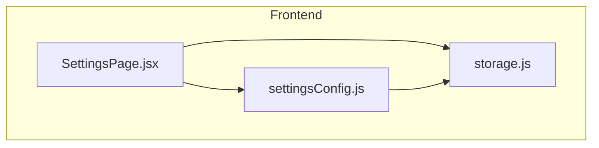
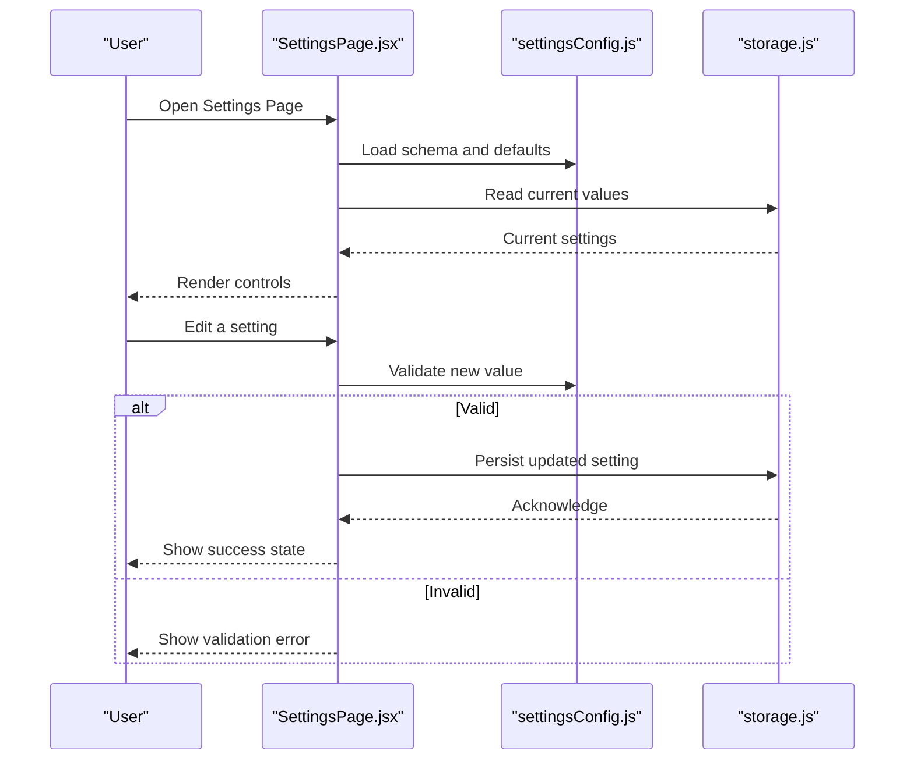
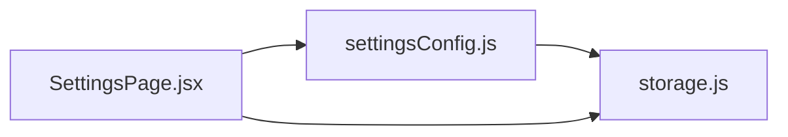
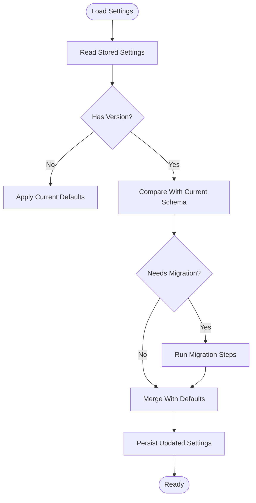
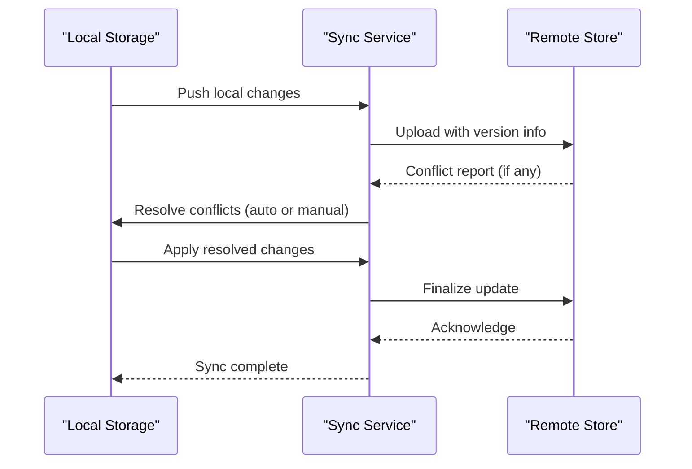

# Settings Configuration

<cite>
**Referenced Files in This Document**
- [settingsConfig.js](file://src/lib/settingsConfig.js)
- [storage.js](file://src/lib/storage.js)
- [SettingsPage.jsx](file://src/pages/SettingsPage.jsx)
</cite>

## Table of Contents
1. [Introduction](#introduction)
2. [Project Structure](#project-structure)
3. [Core Components](#core-components)
4. [Architecture Overview](#architecture-overview)
5. [Detailed Component Analysis](#detailed-component-analysis)
6. [Dependency Analysis](#dependency-analysis)
7. [Performance Considerations](#performance-considerations)
8. [Troubleshooting Guide](#troubleshooting-guide)
9. [Conclusion](#conclusion)
10. [Appendices](#appendices)

## Introduction
This document explains LineCheck’s settings configuration system, focusing on how settings are defined, validated, defaulted, persisted, and consumed at runtime. It also provides guidance for extending the system with new settings, implementing migrations, handling updates, managing user preferences, and synchronizing across devices with conflict resolution strategies.

## Project Structure
The settings subsystem is implemented as a small set of focused modules:
- A schema and defaults definition module that centralizes setting metadata and validation rules.
- A storage abstraction layer that persists settings to the browser environment.
- A UI page that renders and edits settings using the schema and storage layer.

**Diagram sources**
- [SettingsPage.jsx](file://src/pages/SettingsPage.jsx)
- [settingsConfig.js](file://src/lib/settingsConfig.js)
- [storage.js](file://src/lib/storage.js)

**Section sources**
- [settingsConfig.js](file://src/lib/settingsConfig.js)
- [storage.js](file://src/lib/storage.js)
- [SettingsPage.jsx](file://src/pages/SettingsPage.jsx)

## Core Components
- Schema and Defaults (settingsConfig.js): Defines each setting’s type, default value, validation rules, and optional grouping or labels used by the UI.
- Storage Abstraction (storage.js): Provides functions to read, write, and manage settings persistence in the browser’s local storage or similar mechanism.
- Settings UI (SettingsPage.jsx): Reads the schema, renders controls, validates user input, applies changes via the storage layer, and reflects updates reactively.

Key responsibilities:
- Centralized source of truth for setting definitions and defaults.
- Validation before persisting changes.
- Clear separation between data model (schema), persistence (storage), and presentation (UI).

**Section sources**
- [settingsConfig.js](file://src/lib/settingsConfig.js)
- [storage.js](file://src/lib/storage.js)
- [SettingsPage.jsx](file://src/pages/SettingsPage.jsx)

## Architecture Overview
The settings architecture follows a layered approach:
- Definition Layer: Schema and defaults define what settings exist and their constraints.
- Persistence Layer: Storage encapsulates where and how settings are saved.
- Presentation Layer: The Settings page binds UI controls to the schema and delegates writes to storage.

**Diagram sources**
- [SettingsPage.jsx](file://src/pages/SettingsPage.jsx)
- [settingsConfig.js](file://src/lib/settingsConfig.js)
- [storage.js](file://src/lib/storage.js)

## Detailed Component Analysis

### Schema and Defaults (settingsConfig.js)
Purpose:
- Define all available settings with types, default values, and validation rules.
- Provide a single source of truth for both runtime behavior and UI generation.

What to look for:
- Setting identifiers and their types.
- Default values for each setting.
- Validation rules (e.g., required, min/max, allowed values).
- Optional UI hints such as labels or groupings.

How it integrates:
- The UI reads this module to render controls and validate inputs.
- The storage layer may use these definitions to coerce or normalize values before saving.

Extensibility:
- To add a new setting, register it in the schema with its type, default, and validation rules.
- Ensure any dependent components consume the new setting from the same source.

**Section sources**
- [settingsConfig.js](file://src/lib/settingsConfig.js)

### Storage Abstraction (storage.js)
Purpose:
- Encapsulate persistence operations for settings.
- Provide consistent APIs for reading and writing settings.

Typical capabilities:
- Get a specific setting by key.
- Set a specific setting by key.
- Get or set the entire settings object.
- Handle serialization/deserialization if needed.

Error handling:
- Gracefully handle missing keys by returning defaults.
- Surface errors when persistence fails (e.g., quota exceeded).

Migration support:
- Provide hooks or utilities to transform legacy structures into the current schema during load.

**Section sources**
- [storage.js](file://src/lib/storage.js)

### Settings UI (SettingsPage.jsx)
Purpose:
- Present settings to users based on the schema.
- Collect user input and enforce validation before applying changes.
- Reflect real-time updates after successful persistence.

Workflow highlights:
- On mount, load schema and current values.
- Bind form fields to schema-defined controls.
- On change, validate against schema rules.
- On save, persist via storage and update UI state.

Accessibility and UX:
- Use schema-provided labels and descriptions to improve clarity.
- Display inline validation messages for invalid inputs.

**Section sources**
- [SettingsPage.jsx](file://src/pages/SettingsPage.jsx)

## Dependency Analysis
The following diagram shows how the three core files depend on each other:

- SettingsPage depends on both the schema and storage layers.
- The schema may reference storage for normalization or migration helpers.
- Storage remains independent of the UI, enabling reuse elsewhere.

**Diagram sources**
- [settingsConfig.js](file://src/lib/settingsConfig.js)
- [storage.js](file://src/lib/storage.js)
- [SettingsPage.jsx](file://src/pages/SettingsPage.jsx)

**Section sources**
- [settingsConfig.js](file://src/lib/settingsConfig.js)
- [storage.js](file://src/lib/storage.js)
- [SettingsPage.jsx](file://src/pages/SettingsPage.jsx)

## Performance Considerations
- Minimize re-renders by batching multiple setting updates when possible.
- Avoid heavy computations in the UI; perform validation and normalization in dedicated modules.
- Cache frequently accessed settings in memory while ensuring consistency with persistence.
- Debounce frequent writes if the storage backend is slow.

[No sources needed since this section provides general guidance]

## Troubleshooting Guide
Common issues and resolutions:
- Missing or unexpected values: Ensure defaults are provided in the schema and that storage returns defaults for unknown keys.
- Validation failures: Verify that the UI uses the schema’s validation rules consistently and surfaces clear error messages.
- Persistence errors: Check storage availability and quotas; implement fallbacks or user notifications when writes fail.
- Migration problems: Confirm that storage includes logic to upgrade older schemas to the current version on load.

**Section sources**
- [settingsConfig.js](file://src/lib/settingsConfig.js)
- [storage.js](file://src/lib/storage.js)
- [SettingsPage.jsx](file://src/pages/SettingsPage.jsx)

## Conclusion
LineCheck’s settings configuration system is built around a clear separation of concerns: schema-driven definitions, a pluggable storage layer, and a reactive UI. This design simplifies adding new settings, enforcing validation, and maintaining backward compatibility through migrations. For cross-device synchronization, extend the storage layer to integrate with a remote service and apply conflict resolution policies as outlined below.

[No sources needed since this section summarizes without analyzing specific files]

## Appendices

### How to Add a New Setting
Steps:
1. Register the setting in the schema with its type, default value, and validation rules.
2. If the setting requires special formatting or coercion, implement helpers in the schema or storage layer.
3. Update the UI bindings so the new control appears and validates correctly.
4. Test edge cases: empty input, boundary values, and invalid formats.

**Section sources**
- [settingsConfig.js](file://src/lib/settingsConfig.js)
- [SettingsPage.jsx](file://src/pages/SettingsPage.jsx)

### Implementing Setting Migrations
Guidance:
- Maintain a versioned schema or include a migration function in the storage layer.
- On load, detect the stored version and transform legacy structures to the current schema.
- Log migration actions for debugging and provide rollback strategies if necessary.

**Diagram sources**
- [storage.js](file://src/lib/storage.js)
- [settingsConfig.js](file://src/lib/settingsConfig.js)

**Section sources**
- [storage.js](file://src/lib/storage.js)
- [settingsConfig.js](file://src/lib/settingsConfig.js)

### Handling Configuration Updates
Recommendations:
- Validate all incoming updates against the schema before applying.
- Normalize values to canonical forms (e.g., trimming strings, coercing numbers).
- Emit events or callbacks when settings change to notify dependent components.

**Section sources**
- [settingsConfig.js](file://src/lib/settingsConfig.js)
- [storage.js](file://src/lib/storage.js)

### Managing User Preferences
Best practices:
- Keep user-facing labels and descriptions in the schema to ensure consistent messaging.
- Group related settings logically for better discoverability.
- Provide reset-to-default functionality for individual or bulk resets.

**Section sources**
- [settingsConfig.js](file://src/lib/settingsConfig.js)
- [SettingsPage.jsx](file://src/pages/SettingsPage.jsx)

### Defining Complex Settings Structures
Approach:
- Represent nested objects or arrays in the schema with explicit field-level rules.
- Provide helper validators for complex constraints (e.g., unique items, cross-field dependencies).
- Ensure the UI can render and edit nested structures safely.

**Section sources**
- [settingsConfig.js](file://src/lib/settingsConfig.js)

### Implementing Conditional Logic
Guidance:
- Use conditional validation rules based on other settings’ values.
- Dynamically show/hide or enable/disable controls depending on context.
- Keep condition logic centralized in the schema or a dedicated validator module.

**Section sources**
- [settingsConfig.js](file://src/lib/settingsConfig.js)
- [SettingsPage.jsx](file://src/pages/SettingsPage.jsx)

### Validating User Input
Strategies:
- Enforce schema-based validation at the UI and storage boundaries.
- Provide immediate feedback for invalid inputs.
- Sanitize inputs to prevent malformed data from reaching persistence.

**Section sources**
- [settingsConfig.js](file://src/lib/settingsConfig.js)
- [SettingsPage.jsx](file://src/pages/SettingsPage.jsx)

### Persisting Configuration Changes
Patterns:
- Write atomic updates per setting or batched updates for multiple changes.
- Handle write failures gracefully and surface actionable errors to users.
- Consider optimistic UI updates with rollback on failure.

**Section sources**
- [storage.js](file://src/lib/storage.js)
- [SettingsPage.jsx](file://src/pages/SettingsPage.jsx)

### Synchronizing Across Devices
Design options:
- Integrate a remote store in the storage layer to sync settings with a server.
- Use timestamps or vector clocks to determine the latest version of each setting.
- Implement merge strategies for conflicting changes (e.g., last-write-wins, field-level merges).

Conflict Resolution Strategies:
- Last-write-wins: Simple but may overwrite intentional local changes.
- Field-level merge: Combine non-conflicting fields and prompt the user for conflicts.
- Versioned snapshots: Allow users to choose which version to keep.

**Diagram sources**
- [storage.js](file://src/lib/storage.js)

**Section sources**
- [storage.js](file://src/lib/storage.js)