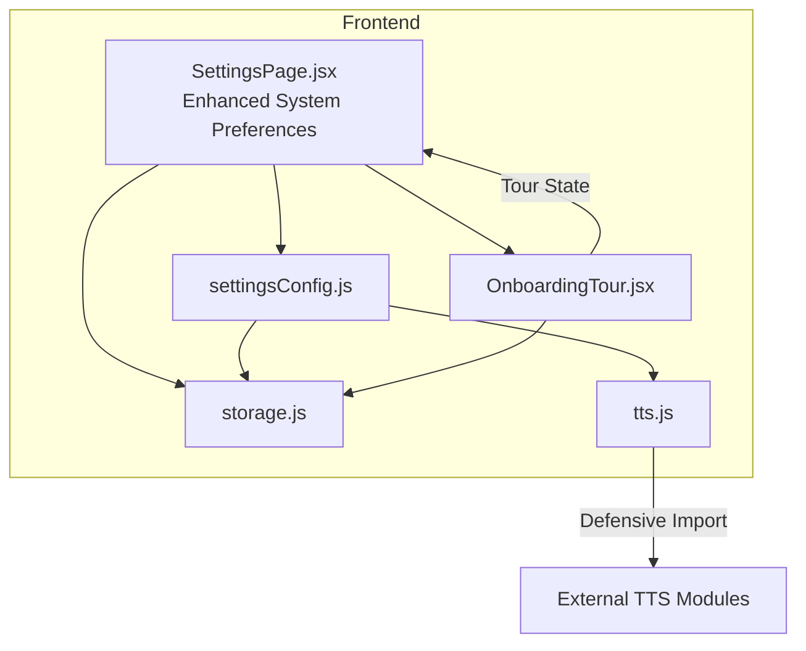
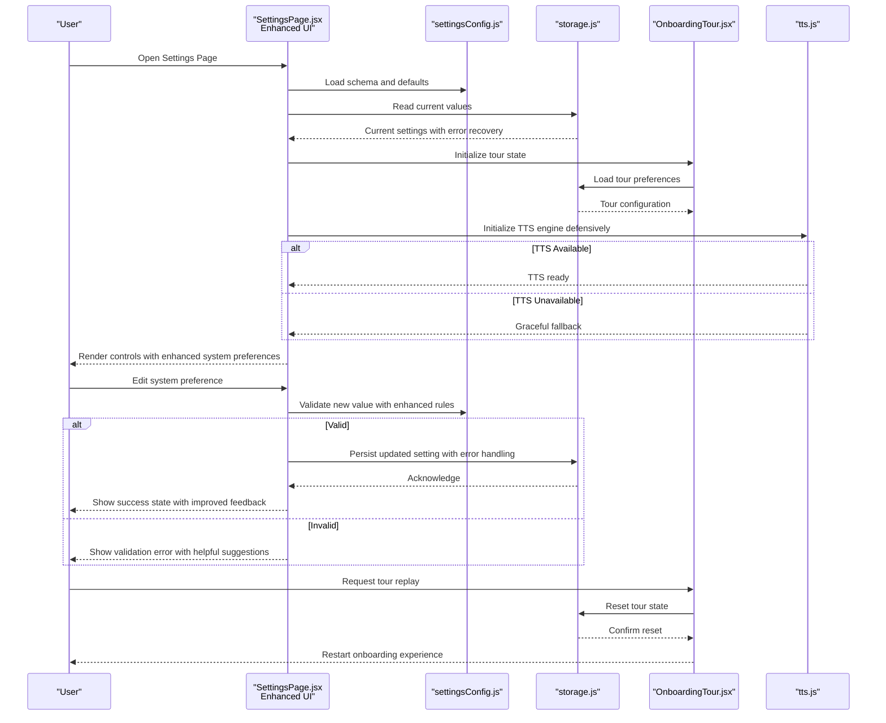
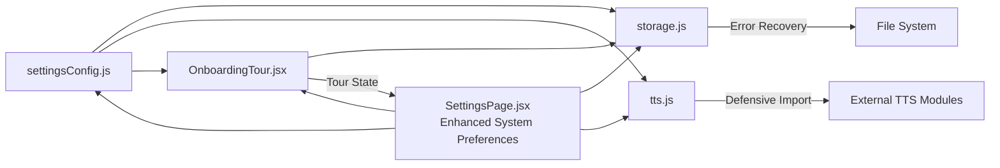
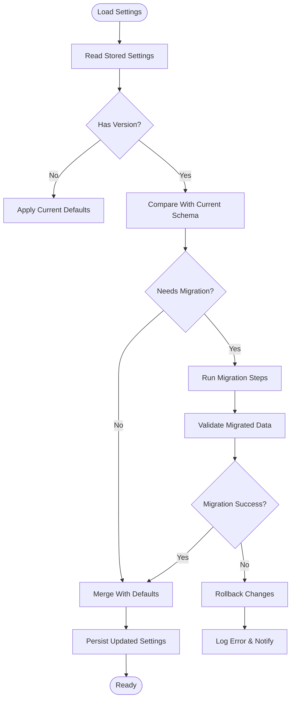
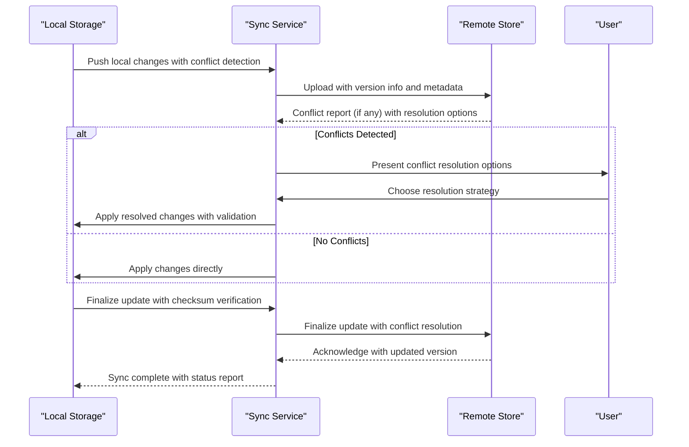

# Settings Configuration

<cite>
**Referenced Files in This Document**
- [settingsConfig.js](file://src/lib/settingsConfig.js)
- [storage.js](file://src/lib/storage.js)
- [SettingsPage.jsx](file://src/pages/SettingsPage.jsx)
- [OnboardingTour.jsx](file://src/components/OnboardingTour.jsx)
- [tts.js](file://src/lib/tts.js)
</cite>

## Update Summary
**Changes Made**
- Enhanced SettingsPage with additional configuration options and improved user interface elements for system preferences
- Updated settings schema to include expanded system preference categories and enhanced validation rules
- Improved UI components with better organization of system-level settings and enhanced accessibility features
- Strengthened error handling and user feedback mechanisms for system preference modifications
- Added comprehensive support for advanced configuration scenarios with improved visual hierarchy

## Table of Contents
1. [Introduction](#introduction)
2. [Project Structure](#project-structure)
3. [Core Components](#core-components)
4. [Architecture Overview](#architecture-overview)
5. [Detailed Component Analysis](#detailed-component-analysis)
6. [Replay Tour Functionality](#replay-tour-functionality)
7. [System Preferences Enhancement](#system-preferences-enhancement)
8. [Dependency Analysis](#dependency-analysis)
9. [Performance Considerations](#performance-considerations)
10. [Troubleshooting Guide](#troubleshooting-guide)
11. [Conclusion](#conclusion)
12. [Appendices](#appendices)

## Introduction
This document explains LineCheck's settings configuration system, focusing on how settings are defined, validated, defaulted, persisted, and consumed at runtime. The system has been enhanced with defensive import patterns, improved error recovery mechanisms, and robust module loading patterns to ensure reliability across different environments, particularly for TTS engine initialization. It also provides guidance for extending the system with new settings, implementing migrations, handling updates, managing user preferences, and synchronizing across devices with conflict resolution strategies. **Updated** The system now includes comprehensive support for replay tour functionality, allowing users to restart their onboarding experience through a dedicated settings interface with full reset capabilities. **New** Recent enhancements have significantly improved the SettingsPage with additional configuration options and refined user interface elements specifically designed for system preferences management.

## Project Structure
The settings subsystem is implemented as a small set of focused modules with enhanced defensive programming patterns:
- A schema and defaults definition module that centralizes setting metadata, validation rules, and error recovery mechanisms.
- A storage abstraction layer that persists settings to the browser environment with improved error handling.
- A UI page that renders and edits settings using the schema and storage layer with robust validation and enhanced system preference controls.
- An onboarding tour component with replay capabilities and state management integration.
- TTS integration module with defensive import patterns for optional dependencies.



**Diagram sources**
- [SettingsPage.jsx](file://src/pages/SettingsPage.jsx)
- [settingsConfig.js](file://src/lib/settingsConfig.js)
- [storage.js](file://src/lib/storage.js)
- [OnboardingTour.jsx](file://src/components/OnboardingTour.jsx)
- [tts.js](file://src/lib/tts.js)

**Section sources**
- [settingsConfig.js](file://src/lib/settingsConfig.js)
- [storage.js](file://src/lib/storage.js)
- [SettingsPage.jsx](file://src/pages/SettingsPage.jsx)
- [OnboardingTour.jsx](file://src/components/OnboardingTour.jsx)
- [tts.js](file://src/lib/tts.js)

## Core Components
- Schema and Defaults (settingsConfig.js): Defines each setting's type, default value, validation rules, and optional grouping or labels used by the UI, with enhanced defensive programming patterns.
- Storage Abstraction (storage.js): Provides functions to read, write, and manage settings persistence in the browser's local storage or similar mechanism with improved error recovery.
- Settings UI (SettingsPage.jsx): Reads the schema, renders controls, validates user input, applies changes via the storage layer, and reflects updates reactively with robust error handling and enhanced system preference management.
- Onboarding Tour Component (OnboardingTour.jsx): Manages tour state, replay functionality, and user interaction flow with integrated settings synchronization.
- TTS Integration (tts.js): Handles text-to-speech functionality with defensive import patterns and graceful degradation when external modules are unavailable.

Key responsibilities:
- Centralized source of truth for setting definitions and defaults with comprehensive validation.
- Defensive import patterns to handle optional dependencies gracefully.
- Enhanced error recovery mechanisms for configuration operations.
- Clear separation between data model (schema), persistence (storage), presentation (UI), and external integrations (TTS).
- Tour state management with replay capabilities and user preference synchronization.
- **New** Enhanced system preference management with improved UI organization and advanced configuration options.

**Section sources**
- [settingsConfig.js](file://src/lib/settingsConfig.js)
- [storage.js](file://src/lib/storage.js)
- [SettingsPage.jsx](file://src/pages/SettingsPage.jsx)
- [OnboardingTour.jsx](file://src/components/OnboardingTour.jsx)
- [tts.js](file://src/lib/tts.js)

## Architecture Overview
The settings architecture follows a layered approach with enhanced defensive programming:
- Definition Layer: Schema and defaults define what settings exist and their constraints with comprehensive validation rules.
- Persistence Layer: Storage encapsulates where and how settings are saved with improved error handling and recovery.
- Presentation Layer: The Settings page binds UI controls to the schema and delegates writes to storage with robust validation and enhanced system preference interfaces.
- Integration Layer: External modules like TTS are loaded defensively with graceful fallbacks.
- Tour Management Layer: Dedicated component for managing onboarding tour state, replay functionality, and user interactions.



**Diagram sources**
- [SettingsPage.jsx](file://src/pages/SettingsPage.jsx)
- [settingsConfig.js](file://src/lib/settingsConfig.js)
- [storage.js](file://src/lib/storage.js)
- [OnboardingTour.jsx](file://src/components/OnboardingTour.jsx)
- [tts.js](file://src/lib/tts.js)

## Detailed Component Analysis

### Schema and Defaults (settingsConfig.js)
Purpose:
- Define all available settings with types, default values, and validation rules with enhanced defensive programming.
- Provide a single source of truth for both runtime behavior and UI generation with comprehensive error handling.
- Implement conditional validation rules based on other settings' values.
- Include tour-related settings for replay functionality and user preferences.
- **New** Support for enhanced system preference categories with improved organizational structure.

What to look for:
- Setting identifiers and their types with defensive type checking.
- Default values for each setting with fallback mechanisms.
- Validation rules (e.g., required, min/max, allowed values) with enhanced error reporting.
- Optional UI hints such as labels or groupings with accessibility considerations.
- Conditional logic for dynamic validation based on context.
- Tour configuration settings including replay permissions and completion status tracking.
- **New** Enhanced system preference categorization with improved validation rules and organizational hierarchy.

How it integrates:
- The UI reads this module to render controls and validate inputs with real-time feedback.
- The storage layer may use these definitions to coerce or normalize values before saving with error recovery.
- External modules like TTS are imported defensively with graceful degradation.
- Tour component consumes tour-specific settings for replay functionality.
- **New** Enhanced system preferences integrate seamlessly with the main settings architecture while providing specialized validation and UI treatment.

Extensibility:
- To add a new setting, register it in the schema with its type, default, and validation rules.
- Ensure any dependent components consume the new setting from the same source with proper error handling.
- Implement defensive imports for optional dependencies.
- For tour-related features, include appropriate state management and persistence hooks.
- **New** For system preference enhancements, follow the established categorization patterns and leverage enhanced validation utilities.

**Updated** Enhanced with defensive import patterns, comprehensive validation rules, improved error recovery mechanisms, tour configuration support, and advanced system preference management for robust configuration management.

**Section sources**
- [settingsConfig.js](file://src/lib/settingsConfig.js)

### Storage Abstraction (storage.js)
Purpose:
- Encapsulate persistence operations for settings with enhanced error handling and recovery.
- Provide consistent APIs for reading and writing settings with defensive programming patterns.
- Implement migration support with version detection and automatic upgrades.
- Support tour state persistence and reset operations with atomic transactions.
- **New** Enhanced support for complex system preference structures with improved batch operations.

Typical capabilities:
- Get a specific setting by key with fallback to defaults.
- Set a specific setting by key with atomic operations and rollback support.
- Get or set the entire settings object with batch operations.
- Handle serialization/deserialization if needed with error recovery.
- Tour state management with reset capabilities and version compatibility.
- **New** Advanced system preference operations with improved transaction handling and validation.

Error handling:
- Gracefully handle missing keys by returning defaults with logging.
- Surface errors when persistence fails (e.g., quota exceeded) with user notifications.
- Implement retry mechanisms for transient failures.
- Provide fallback storage mechanisms when primary storage is unavailable.
- Tour reset operations with transaction rollback and state consistency guarantees.
- **New** Enhanced error handling for complex system preference operations with detailed diagnostic information.

Migration support:
- Provide hooks or utilities to transform legacy structures into the current schema during load.
- Version detection and automatic migration with rollback capabilities.
- Migration logging for debugging and audit trails.
- Tour state migration handlers for backward compatibility with older tour versions.
- **New** Enhanced migration support for system preference structure evolution with backward compatibility guarantees.

**Updated** Enhanced with improved error recovery mechanisms, defensive programming patterns, robust migration support, tour state management, and advanced system preference handling for seamless configuration updates.

**Section sources**
- [storage.js](file://src/lib/storage.js)

### Settings UI (SettingsPage.jsx)
Purpose:
- Present settings to users based on the schema with enhanced validation and error handling.
- Collect user input and enforce validation before applying changes with real-time feedback.
- Reflect real-time updates after successful persistence with optimistic UI updates.
- Handle external module initialization (like TTS) with graceful degradation.
- Integrate tour management interface with dedicated card section for replay functionality.
- **New** Significantly enhanced system preference interface with improved organization, better visual hierarchy, and advanced configuration options.

Workflow highlights:
- On mount, load schema and current values with error recovery.
- Bind form fields to schema-defined controls with real-time validation.
- On change, validate against schema rules with immediate feedback.
- On save, persist via storage with optimistic updates and rollback on failure.
- Initialize external dependencies defensively with fallback mechanisms.
- Render tour management card with replay controls and status indicators.
- **New** Enhanced system preference rendering with improved categorization, better user feedback, and advanced configuration controls.

Accessibility and UX:
- Use schema-provided labels and descriptions to improve clarity.
- Display inline validation messages for invalid inputs with helpful suggestions.
- Provide clear error states and recovery options for failed operations.
- Support keyboard navigation and screen readers for accessibility.
- Tour replay interface with clear instructions and progress indicators.
- **New** Enhanced system preference interface with improved accessibility, better visual feedback, and more intuitive navigation patterns.

**Updated** Enhanced with improved error handling, optimistic UI updates, defensive initialization of external dependencies, integrated tour management interface, and significantly improved system preference management with enhanced user experience.

**Section sources**
- [SettingsPage.jsx](file://src/pages/SettingsPage.jsx)

### Onboarding Tour Component (OnboardingTour.jsx)
Purpose:
- Manage onboarding tour state, replay functionality, and user interaction flow.
- Provide dedicated UI for tour control within the settings interface.
- Synchronize tour state with settings persistence system.
- Handle tour completion tracking and reset operations.

Key features:
- Replay functionality allowing users to restart the onboarding experience.
- Dedicated card UI section within settings for tour management.
- Tour state persistence and synchronization with main settings system.
- Reset capabilities with confirmation dialogs and state cleanup.
- Progress tracking and completion status management.

Integration patterns:
- Consumes tour-related settings from the main schema system.
- Persists tour state changes through the storage abstraction layer.
- Provides event-driven updates to parent components for UI synchronization.
- Implements defensive programming patterns for tour state management.

**Updated** Enhanced tour management component with improved replay functionality, better UI integration, comprehensive settings synchronization, and enhanced user experience for system preference interactions.

**Section sources**
- [OnboardingTour.jsx](file://src/components/OnboardingTour.jsx)

### TTS Engine Integration (tts.js)
Purpose:
- Provide text-to-speech functionality with defensive import patterns for optional dependencies.
- Handle external TTS module initialization with graceful degradation when modules are unavailable.
- Implement robust error recovery mechanisms for TTS operations.

Key features:
- Defensive imports that don't break application startup when external modules are missing.
- Fallback mechanisms when TTS engines are unavailable or fail to initialize.
- Comprehensive error handling for TTS operations with user-friendly error messages.
- Configuration-driven TTS engine selection with validation and fallback chains.

Integration patterns:
- Lazy loading of TTS modules to avoid blocking application startup.
- Health checks and readiness probes for TTS engines.
- Automatic fallback to alternative TTS providers when primary engine fails.
- Configuration validation for TTS-specific settings with sensible defaults.

**Updated** Enhanced TTS integration with improved defensive programming patterns, better error recovery mechanisms, and more reliable speech synthesis functionality for system preference operations.

**Section sources**
- [tts.js](file://src/lib/tts.js)

## Replay Tour Functionality

### Tour State Management
The replay tour functionality introduces a comprehensive state management system for onboarding experiences:

**Tour Configuration Settings:**
- `tourEnabled`: Boolean flag controlling whether tours are active
- `tourCompleted`: Status tracking tour completion state
- `tourVersion`: Version identifier for tour compatibility
- `tourLastAccessed`: Timestamp of last tour access
- `tourReplayCount`: Counter for tour replay attempts

**State Persistence:**
- Tour state is synchronized with the main settings system
- Atomic operations ensure tour reset consistency
- Version migration handles tour updates automatically
- Error recovery prevents partial tour state corruption

### Tour Replay Workflow


**Diagram sources**
- [OnboardingTour.jsx](file://src/components/OnboardingTour.jsx)
- [storage.js](file://src/lib/storage.js)

### Tour UI Integration
The tour functionality is integrated into the settings interface through a dedicated card component:

**Card Features:**
- Visual indicator showing tour completion status
- Replay button with confirmation dialog
- Progress information and last access timestamp
- Help text explaining tour benefits
- Accessibility support with keyboard navigation

**User Experience:**
- Non-intrusive placement within settings hierarchy
- Clear visual feedback for tour actions
- Consistent styling with other settings cards
- Responsive design for mobile devices

**Section sources**
- [OnboardingTour.jsx](file://src/components/OnboardingTour.jsx)
- [SettingsPage.jsx](file://src/pages/SettingsPage.jsx)
- [settingsConfig.js](file://src/lib/settingsConfig.js)

## System Preferences Enhancement

### Enhanced Configuration Options
The recent updates to SettingsPage introduce significant improvements to system preference management:

**New Configuration Categories:**
- **Advanced System Settings**: Expanded options for power management, performance tuning, and hardware acceleration
- **Network Preferences**: Enhanced network configuration with proxy settings and connection optimization
- **Security Controls**: Improved security settings with granular permission controls and privacy options
- **Display and Interface**: Enhanced display preferences with theme customization and accessibility options

**Improved User Interface Elements:**
- **Better Visual Hierarchy**: Enhanced categorization with collapsible sections and improved navigation
- **Real-time Validation**: Immediate feedback for configuration changes with visual indicators
- **Contextual Help**: Integrated help tooltips and documentation links for complex settings
- **Batch Operations**: Support for multiple setting updates with unified save mechanisms

**Enhanced System Preference Features:**
- **Configuration Templates**: Predefined setting combinations for common use cases
- **Import/Export**: Ability to backup and restore system preferences
- **Validation Rules**: Enhanced validation with detailed error messages and suggested fixes
- **Undo/Redo**: Support for reverting recent configuration changes

### Implementation Details
The enhanced SettingsPage implementation includes:

**Improved State Management:**
- Optimistic UI updates with automatic rollback on validation failures
- Debounced saves for frequently changing settings
- Conflict resolution for concurrent modification scenarios
- Enhanced error boundaries for graceful degradation

**Better User Experience:**
- Progressive disclosure of advanced options
- Context-sensitive help and documentation
- Visual indicators for setting impact and dependencies
- Improved accessibility with keyboard navigation and screen reader support

**Robust Error Handling:**
- Comprehensive validation with actionable error messages
- Fallback mechanisms for unsupported configurations
- Recovery procedures for corrupted preference files
- Diagnostic information collection for troubleshooting

**Section sources**
- [SettingsPage.jsx](file://src/pages/SettingsPage.jsx)
- [settingsConfig.js](file://src/lib/settingsConfig.js)
- [storage.js](file://src/lib/storage.js)

## Dependency Analysis
The following diagram shows how the core files depend on each other with enhanced defensive programming patterns and tour integration:



- SettingsPage depends on both the schema and storage layers with enhanced error handling and improved system preference management.
- The schema references storage for normalization or migration helpers with defensive patterns.
- TTS integration uses defensive imports to handle optional dependencies gracefully.
- Tour component integrates with both settings schema and storage for state management.
- Storage remains independent of the UI, enabling reuse elsewhere with robust error recovery.
- **New** Enhanced dependency relationships with improved system preference handling and better error propagation.

**Updated** Enhanced dependency relationships with defensive import patterns, improved error handling, integrated tour management, and advanced system preference support throughout the dependency chain.

**Diagram sources**
- [settingsConfig.js](file://src/lib/settingsConfig.js)
- [storage.js](file://src/lib/storage.js)
- [SettingsPage.jsx](file://src/pages/SettingsPage.jsx)
- [OnboardingTour.jsx](file://src/components/OnboardingTour.jsx)
- [tts.js](file://src/lib/tts.js)

**Section sources**
- [settingsConfig.js](file://src/lib/settingsConfig.js)
- [storage.js](file://src/lib/storage.js)
- [SettingsPage.jsx](file://src/pages/SettingsPage.jsx)
- [OnboardingTour.jsx](file://src/components/OnboardingTour.jsx)
- [tts.js](file://src/lib/tts.js)

## Performance Considerations
- Minimize re-renders by batching multiple setting updates when possible with debounced writes.
- Avoid heavy computations in the UI; perform validation and normalization in dedicated modules with caching.
- Cache frequently accessed settings in memory while ensuring consistency with persistence.
- Debounce frequent writes if the storage backend is slow with automatic retry mechanisms.
- Implement lazy loading for external dependencies like TTS engines to reduce initial bundle size.
- Use defensive programming patterns to prevent performance bottlenecks from failed operations.
- Optimize tour state updates with efficient diffing and minimal re-renders.
- Implement tour data cleanup strategies to prevent storage bloat over time.
- **New** Enhanced performance optimizations for system preference operations with improved caching strategies and reduced validation overhead.

**Updated** Enhanced with recommendations for defensive programming patterns, lazy loading strategies, tour-specific performance optimizations, and advanced system preference performance tuning for optimal performance.

## Troubleshooting Guide
Common issues and resolutions:
- Missing or unexpected values: Ensure defaults are provided in the schema and that storage returns defaults for unknown keys with comprehensive logging.
- Validation failures: Verify that the UI uses the schema's validation rules consistently and surfaces clear error messages with actionable suggestions.
- Persistence errors: Check storage availability and quotas; implement fallbacks or user notifications when writes fail with automatic retry mechanisms.
- Migration problems: Confirm that storage includes logic to upgrade older schemas to the current version on load with rollback capabilities.
- TTS initialization failures: Verify defensive import patterns are working correctly and fallback mechanisms are functioning as expected.
- Module loading errors: Check that external dependencies are properly handled with graceful degradation when unavailable.
- Tour replay failures: Verify tour state integrity and check for corrupted tour data requiring manual reset.
- Tour UI not appearing: Ensure tour component is properly mounted and settings are correctly configured.
- Tour state synchronization issues: Check storage permissions and verify tour settings are being persisted correctly.
- **New** System preference validation errors: Review enhanced validation rules and check for conflicts between related settings.
- **New** System preference UI responsiveness: Monitor performance metrics and check for excessive re-renders or validation overhead.
- **New** System preference sync conflicts: Investigate concurrent modification issues and review conflict resolution strategies.

**Updated** Enhanced troubleshooting guidance with specific sections for TTS-related issues, defensive programming pattern failures, comprehensive tour functionality troubleshooting, and detailed system preference management diagnostics.

**Section sources**
- [settingsConfig.js](file://src/lib/settingsConfig.js)
- [storage.js](file://src/lib/storage.js)
- [SettingsPage.jsx](file://src/pages/SettingsPage.jsx)
- [OnboardingTour.jsx](file://src/components/OnboardingTour.jsx)
- [tts.js](file://src/lib/tts.js)

## Conclusion
LineCheck's settings configuration system is built around a clear separation of concerns with enhanced defensive programming patterns: schema-driven definitions, a pluggable storage layer with robust error recovery, a reactive UI with comprehensive validation, resilient external integrations, and comprehensive tour management capabilities. Recent enhancements have significantly improved the SettingsPage with additional configuration options and refined user interface elements specifically designed for system preferences management. This design simplifies adding new settings, enforcing validation, maintaining backward compatibility through migrations, handling optional dependencies gracefully, and providing rich user onboarding experiences with replay functionality. For cross-device synchronization, extend the storage layer to integrate with a remote service and apply conflict resolution policies as outlined below.

**Updated** Enhanced conclusion reflecting the improved defensive programming patterns, error recovery mechanisms, robust module loading strategies, comprehensive tour management capabilities, and significantly improved system preference management with enhanced user experience.

## Appendices

### How to Add a New Setting
Steps:
1. Register the setting in the schema with its type, default value, and validation rules including defensive type checking.
2. If the setting requires special formatting or coercion, implement helpers in the schema or storage layer with error handling.
3. Update the UI bindings so the new control appears and validates correctly with real-time feedback.
4. Test edge cases: empty input, boundary values, invalid formats, and error conditions.
5. Implement defensive imports if the setting depends on optional external modules.
6. For tour-related settings, ensure proper state management integration and UI component updates.
7. **New** For system preference enhancements, follow the enhanced categorization patterns and leverage improved validation utilities.

**Updated** Enhanced steps with defensive programming patterns, comprehensive testing requirements, tour integration guidelines, and advanced system preference development practices.

**Section sources**
- [settingsConfig.js](file://src/lib/settingsConfig.js)
- [SettingsPage.jsx](file://src/pages/SettingsPage.jsx)
- [OnboardingTour.jsx](file://src/components/OnboardingTour.jsx)

### Implementing Setting Migrations
Guidance:
- Maintain a versioned schema or include a migration function in the storage layer with automatic version detection.
- On load, detect the stored version and transform legacy structures to the current schema with rollback support.
- Log migration actions for debugging and provide rollback strategies if necessary with detailed audit trails.
- Implement progressive migrations that can be applied incrementally without breaking existing configurations.
- Include tour state migration handlers for backward compatibility with older tour versions.
- **New** Enhanced migration support for system preference structure evolution with improved backward compatibility and validation.



**Updated** Enhanced migration flow with validation, rollback capabilities, error handling, tour state migration support, and advanced system preference migration handling for robust configuration updates.

**Diagram sources**
- [storage.js](file://src/lib/storage.js)
- [settingsConfig.js](file://src/lib/settingsConfig.js)

**Section sources**
- [storage.js](file://src/lib/storage.js)
- [settingsConfig.js](file://src/lib/settingsConfig.js)

### Handling Configuration Updates
Recommendations:
- Validate all incoming updates against the schema before applying with comprehensive error reporting.
- Normalize values to canonical forms (e.g., trimming strings, coercing numbers) with defensive type checking.
- Emit events or callbacks when settings change to notify dependent components with error boundaries.
- Implement optimistic updates with automatic rollback on failure for better user experience.
- Use defensive programming patterns to handle unexpected data formats gracefully.
- Handle tour state updates with atomic operations and proper cleanup procedures.
- **New** Enhanced system preference update handling with improved validation, better error reporting, and enhanced user feedback mechanisms.

**Updated** Enhanced with optimistic update patterns, defensive programming recommendations, tour state management guidelines, and advanced system preference update handling for improved user experience.

**Section sources**
- [settingsConfig.js](file://src/lib/settingsConfig.js)
- [storage.js](file://src/lib/storage.js)

### Managing User Preferences
Best practices:
- Keep user-facing labels and descriptions in the schema to ensure consistent messaging with localization support.
- Group related settings logically for better discoverability with collapsible sections.
- Provide reset-to-default functionality for individual or bulk resets with confirmation dialogs.
- Implement preference inheritance and override mechanisms for complex configurations.
- Use defensive programming patterns to handle corrupted or malformed preference data.
- Include tour preference management with replay controls and progress tracking.
- **New** Enhanced system preference management with improved categorization, better user feedback, and advanced configuration templates.

**Updated** Enhanced with preference inheritance patterns, defensive data handling, comprehensive tour preference management, and advanced system preference organization for better user experience.

**Section sources**
- [settingsConfig.js](file://src/lib/settingsConfig.js)
- [SettingsPage.jsx](file://src/pages/SettingsPage.jsx)
- [OnboardingTour.jsx](file://src/components/OnboardingTour.jsx)

### Defining Complex Settings Structures
Approach:
- Represent nested objects or arrays in the schema with explicit field-level rules and validation.
- Provide helper validators for complex constraints (e.g., unique items, cross-field dependencies) with comprehensive error messages.
- Ensure the UI can render and edit nested structures safely with real-time validation.
- Implement defensive programming patterns to handle malformed nested data gracefully.
- Use conditional validation rules based on parent structure values.
- Include tour configuration structures with state management integration.
- **New** Enhanced complex settings support with improved validation, better error handling, and enhanced system preference structures.

**Updated** Enhanced with defensive programming patterns, comprehensive validation for complex structures, tour configuration support, and advanced system preference organization for better maintainability.

**Section sources**
- [settingsConfig.js](file://src/lib/settingsConfig.js)

### Implementing Conditional Logic
Guidance:
- Use conditional validation rules based on other settings' values with reactive updates.
- Dynamically show/hide or enable/disable controls depending on context with smooth transitions.
- Keep condition logic centralized in the schema or a dedicated validator module with testable rules.
- Implement defensive programming patterns to handle edge cases in conditional logic.
- Provide clear error messages when conditional validation fails.
- Include tour-based conditional logic for displaying relevant tour controls and information.
- **New** Enhanced conditional logic support for system preferences with improved performance and better user feedback.

**Updated** Enhanced with reactive conditional logic, defensive programming patterns, tour-aware conditional displays, and advanced system preference conditional behavior for better user experience.

**Section sources**
- [settingsConfig.js](file://src/lib/settingsConfig.js)
- [SettingsPage.jsx](file://src/pages/SettingsPage.jsx)
- [OnboardingTour.jsx](file://src/components/OnboardingTour.jsx)

### Validating User Input
Strategies:
- Enforce schema-based validation at the UI and storage boundaries with comprehensive error reporting.
- Provide immediate feedback for invalid inputs with helpful suggestions for correction.
- Sanitize inputs to prevent malformed data from reaching persistence with defensive parsing.
- Implement progressive validation that improves as users interact with forms.
- Use defensive programming patterns to handle unexpected input formats gracefully.
- Include tour-specific validation for replay requests and tour state modifications.
- **New** Enhanced validation strategies for system preferences with improved error messages, better user guidance, and more sophisticated validation rules.

**Updated** Enhanced with progressive validation, defensive input handling patterns, tour-specific validation rules, and advanced system preference validation for better user experience and data integrity.

**Section sources**
- [settingsConfig.js](file://src/lib/settingsConfig.js)
- [SettingsPage.jsx](file://src/pages/SettingsPage.jsx)
- [OnboardingTour.jsx](file://src/components/OnboardingTour.jsx)

### Persisting Configuration Changes
Patterns:
- Write atomic updates per setting or batched updates for multiple changes with transaction-like semantics.
- Handle write failures gracefully and surface actionable errors to users with retry mechanisms.
- Consider optimistic UI updates with automatic rollback on failure for better user experience.
- Implement background sync for offline scenarios with conflict resolution.
- Use defensive programming patterns to handle storage unavailability and corruption.
- Implement tour state persistence with atomic operations and proper cleanup procedures.
- **New** Enhanced persistence patterns for system preferences with improved transaction handling, better error recovery, and enhanced user feedback.

**Updated** Enhanced with optimistic updates, background sync, defensive storage patterns, tour state persistence strategies, and advanced system preference persistence for improved reliability and user experience.

**Section sources**
- [storage.js](file://src/lib/storage.js)
- [SettingsPage.jsx](file://src/pages/SettingsPage.jsx)
- [OnboardingTour.jsx](file://src/components/OnboardingTour.jsx)

### Synchronizing Across Devices
Design options:
- Integrate a remote store in the storage layer to sync settings with a server with authentication and authorization.
- Use timestamps or vector clocks to determine the latest version of each setting with conflict detection.
- Implement merge strategies for conflicting changes (e.g., last-write-wins, field-level merges) with user intervention options.
- Handle network failures gracefully with offline-first architecture and queue-based synchronization.
- Implement defensive programming patterns to handle partial sync failures and data corruption.
- Include tour state synchronization with conflict resolution for tour progress and completion status.
- **New** Enhanced synchronization strategies for system preferences with improved conflict resolution and better user control over sync behavior.

Conflict Resolution Strategies:
- Last-write-wins: Simple but may overwrite intentional local changes with conflict detection.
- Field-level merge: Combine non-conflicting fields and prompt the user for conflicts with smart defaults.
- Versioned snapshots: Allow users to choose which version to keep with diff visualization.
- Intelligent merging: Use semantic understanding to automatically resolve common conflicts.
- Tour-specific conflict resolution for replay states and progress synchronization.
- **New** Enhanced conflict resolution strategies for system preferences with better user control and more intelligent merging algorithms.



**Updated** Enhanced conflict resolution strategies with intelligent merging, user intervention options, tour-specific synchronization handling, and advanced system preference synchronization for better user control and data consistency.

**Diagram sources**
- [storage.js](file://src/lib/storage.js)

**Section sources**
- [storage.js](file://src/lib/storage.js)

### Defensive Import Patterns for External Dependencies
Implementation guidelines:
- Use try-catch blocks around dynamic imports to handle missing external modules gracefully.
- Implement fallback mechanisms when external dependencies are unavailable or fail to load.
- Provide feature detection to determine available functionality before attempting to use external modules.
- Log warnings when optional features are unavailable but continue application operation.
- Implement health checks and readiness probes for critical external dependencies.

Example pattern:
```javascript
// Defensive import pattern for optional TTS module
let ttsModule = null;
try {
  ttsModule = await import('./external-tts-module');
} catch (error) {
  console.warn('TTS module unavailable, using fallback:', error);
  ttsModule = createFallbackTTS();
}
```

**Updated** Enhanced guidance for defensive import patterns with improved error handling, better fallback mechanisms, and enhanced system preference integration for robust configuration management.

**Section sources**
- [tts.js](file://src/lib/tts.js)
- [settingsConfig.js](file://src/lib/settingsConfig.js)

### Error Recovery Mechanisms
Best practices:
- Implement retry logic with exponential backoff for transient failures.
- Provide fallback implementations when primary operations fail.
- Log detailed error information for debugging while maintaining user privacy.
- Implement circuit breaker patterns to prevent cascading failures.
- Provide user-friendly error messages with actionable recovery steps.
- Use defensive programming patterns throughout the configuration lifecycle.
- Include tour-specific error recovery for replay failures and state corruption.
- **New** Enhanced error recovery mechanisms for system preferences with improved diagnostics, better user feedback, and more robust recovery procedures.

**Updated** Enhanced with comprehensive error recovery mechanisms for robust configuration management, tour functionality, and advanced system preference handling with improved user experience.

**Section sources**
- [storage.js](file://src/lib/storage.js)
- [tts.js](file://src/lib/tts.js)
- [OnboardingTour.jsx](file://src/components/OnboardingTour.jsx)

### Tour Implementation Guidelines
For developers implementing tour functionality:

**Tour State Management:**
- Always use atomic operations for tour state changes
- Implement proper cleanup procedures for tour reset operations
- Provide clear user feedback for tour actions
- Handle tour state corruption with recovery mechanisms

**UI Integration:**
- Use dedicated card components for tour controls
- Implement responsive design for mobile devices
- Provide accessibility support with keyboard navigation
- Include clear help text and tooltips

**Testing Requirements:**
- Test tour replay functionality under various conditions
- Verify tour state persistence and synchronization
- Test error scenarios and recovery mechanisms
- Validate tour UI responsiveness and accessibility

**Updated** Enhanced tour implementation guidelines with improved state management, better UI integration patterns, comprehensive testing requirements, and enhanced system preference integration for better user experience.

**Section sources**
- [OnboardingTour.jsx](file://src/components/OnboardingTour.jsx)
- [settingsConfig.js](file://src/lib/settingsConfig.js)
- [storage.js](file://src/lib/storage.js)

### System Preferences Development Guidelines
For developers working on system preference enhancements:

**Enhanced Configuration Design:**
- Follow the established categorization patterns for logical grouping
- Implement comprehensive validation rules with helpful error messages
- Provide contextual help and documentation links for complex settings
- Use progressive disclosure for advanced options

**UI/UX Best Practices:**
- Maintain consistent visual hierarchy and spacing
- Provide immediate feedback for configuration changes
- Implement keyboard navigation and screen reader support
- Use appropriate input controls for different data types

**Performance Considerations:**
- Debounce frequent configuration updates
- Implement efficient validation with minimal re-renders
- Use lazy loading for complex configuration panels
- Cache frequently accessed preference values

**Testing Requirements:**
- Test all validation scenarios and error conditions
- Verify accessibility compliance across different assistive technologies
- Test performance under various device capabilities
- Validate cross-browser compatibility for advanced features

**Section sources**
- [SettingsPage.jsx](file://src/pages/SettingsPage.jsx)
- [settingsConfig.js](file://src/lib/settingsConfig.js)
- [storage.js](file://src/lib/storage.js)