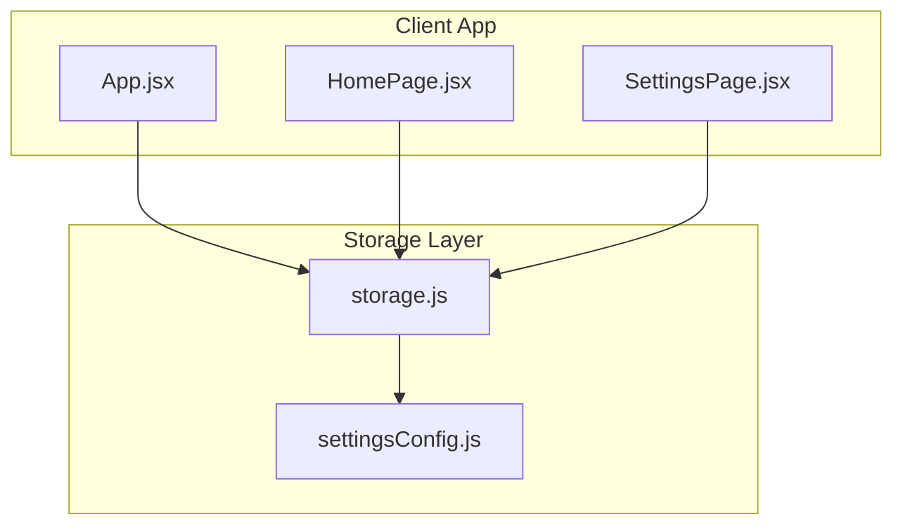
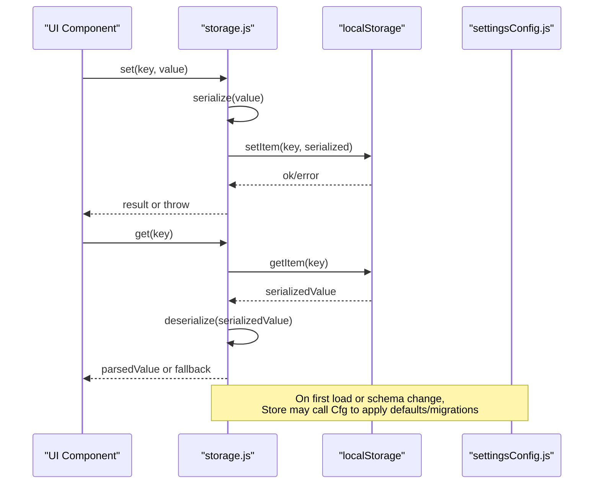
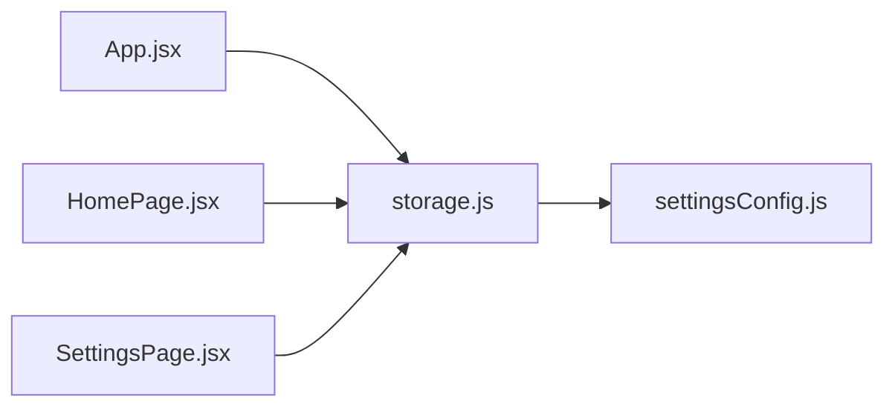

# Storage Management

<cite>
**Referenced Files in This Document**
- [storage.js](file://src/lib/storage.js)
- [settingsConfig.js](file://src/lib/settingsConfig.js)
- [App.jsx](file://src/App.jsx)
- [HomePage.jsx](file://src/pages/HomePage.jsx)
- [SettingsPage.jsx](file://src/pages/SettingsPage.jsx)
</cite>

## Table of Contents
1. [Introduction](#introduction)
2. [Project Structure](#project-structure)
3. [Core Components](#core-components)
4. [Architecture Overview](#architecture-overview)
5. [Detailed Component Analysis](#detailed-component-analysis)
6. [Dependency Analysis](#dependency-analysis)
7. [Performance Considerations](#performance-considerations)
8. [Troubleshooting Guide](#troubleshooting-guide)
9. [Conclusion](#conclusion)
10. [Appendices](#appendices)

## Introduction
This document explains LineCheck’s storage management utility, focusing on local storage operations, data persistence patterns, key-value interface, serialization/deserialization, quotas and limits, error handling, migration strategies, backup/restore, complex object handling, versioning, security considerations, and performance optimization techniques. The goal is to provide both a conceptual overview and code-level guidance for developers working with persistent client-side data in the application.

## Project Structure
The storage subsystem centers around a dedicated module that encapsulates all interactions with the browser’s local storage. Other modules import this module to read or write application state and user settings.

**Diagram sources**
- [App.jsx](file://src/App.jsx)
- [HomePage.jsx](file://src/pages/HomePage.jsx)
- [SettingsPage.jsx](file://src/pages/SettingsPage.jsx)
- [storage.js](file://src/lib/storage.js)
- [settingsConfig.js](file://src/lib/settingsConfig.js)

**Section sources**
- [storage.js](file://src/lib/storage.js)
- [settingsConfig.js](file://src/lib/settingsConfig.js)
- [App.jsx](file://src/App.jsx)
- [HomePage.jsx](file://src/pages/HomePage.jsx)
- [SettingsPage.jsx](file://src/pages/SettingsPage.jsx)

## Core Components
- Local storage wrapper: Provides a consistent key-value API over the browser’s localStorage, including get/set/remove/clear and batched operations. It handles JSON serialization/deserialization and centralizes error handling for quota exceeded or corrupted values.
- Settings configuration: Defines default settings, schema, and any versioning metadata used during migrations.
- UI integration points: Pages and top-level app components consume the storage layer to persist user preferences and transient state.

Key responsibilities:
- Encapsulate localStorage access behind a stable interface.
- Ensure safe parsing and stringification of stored values.
- Provide migration hooks when data schemas evolve.
- Surface meaningful errors when storage fails (e.g., quota exceeded).

**Section sources**
- [storage.js](file://src/lib/storage.js)
- [settingsConfig.js](file://src/lib/settingsConfig.js)

## Architecture Overview
The storage architecture follows a thin abstraction over localStorage with clear separation between persistence logic and UI usage.

**Diagram sources**
- [storage.js](file://src/lib/storage.js)
- [settingsConfig.js](file://src/lib/settingsConfig.js)

## Detailed Component Analysis

### Storage Module (storage.js)
Responsibilities:
- Key-value operations: get, set, remove, clear.
- Serialization/deserialization: safely stringify and parse values; handle malformed entries.
- Error handling: catch quota exceeded and other exceptions; surface actionable errors.
- Migration support: detect version changes and migrate legacy keys or structures.
- Backup/restore helpers: export/import snapshots of selected namespaces or keys.

Operational patterns:
- All writes are wrapped in try/catch to prevent crashes from storage failures.
- Reads return typed defaults when values are missing or invalid.
- Batched updates minimize reflows and reduce repeated serialization overhead.

Complex object handling:
- Only serializable primitives and plain objects/arrays should be persisted.
- For large payloads, consider chunking or compressing before storing.

Versioning strategy:
- Maintain a version field in settings or a dedicated meta key.
- On startup, compare current schema version with stored version and run migrations if needed.

Backup/restore:
- Export: collect relevant keys into a single snapshot object and offer download.
- Import: validate incoming snapshot shape, merge selectively, and update version.

Security considerations:
- Avoid storing secrets or tokens in localStorage.
- If sensitive data must be cached, prefer short-lived memory caches or secure mechanisms where available.

Error handling examples:
- Quota exceeded: prompt user to clear unused data or reduce payload size.
- Corrupted entry: log warning, replace with defaults, and optionally notify the user.

**Section sources**
- [storage.js](file://src/lib/storage.js)

### Settings Configuration (settingsConfig.js)
Responsibilities:
- Define default settings and their types.
- Provide schema and version metadata used by the storage layer for migrations.
- Offer validation helpers to ensure new values conform to expected shapes.

Migration hooks:
- Map old keys to new ones.
- Transform nested structures to match updated schemas.
- Apply incremental upgrades across versions.

**Section sources**
- [settingsConfig.js](file://src/lib/settingsConfig.js)

### UI Integration Points
- App initialization: loads initial settings and applies migrations before rendering.
- Settings page: reads/writes user preferences via the storage module.
- Home page: persists transient state such as last session or temporary drafts.

Usage patterns:
- Prefer small, focused keys for settings.
- Group related keys under a namespace prefix to simplify backups and migrations.

**Section sources**
- [App.jsx](file://src/App.jsx)
- [SettingsPage.jsx](file://src/pages/SettingsPage.jsx)
- [HomePage.jsx](file://src/pages/HomePage.jsx)

## Dependency Analysis
The storage layer is a leaf dependency consumed by multiple UI components. The settings configuration is consumed by the storage layer to bootstrap defaults and migrations.

**Diagram sources**
- [App.jsx](file://src/App.jsx)
- [HomePage.jsx](file://src/pages/HomePage.jsx)
- [SettingsPage.jsx](file://src/pages/SettingsPage.jsx)
- [storage.js](file://src/lib/storage.js)
- [settingsConfig.js](file://src/lib/settingsConfig.js)

**Section sources**
- [storage.js](file://src/lib/storage.js)
- [settingsConfig.js](file://src/lib/settingsConfig.js)
- [App.jsx](file://src/App.jsx)
- [HomePage.jsx](file://src/pages/HomePage.jsx)
- [SettingsPage.jsx](file://src/pages/SettingsPage.jsx)

## Performance Considerations
- Minimize serialization cost: avoid deep cloning large objects; store only necessary fields.
- Batch updates: group multiple writes to reduce repeated I/O and parsing overhead.
- Lazy loading: defer heavy computations until after storage reads complete.
- Debounce frequent writes: e.g., autosave drafts at intervals rather than on every keystroke.
- Use efficient key names and prefixes to simplify scanning and backups.
- Monitor storage size: implement soft limits and warn users when approaching quotas.

[No sources needed since this section provides general guidance]

## Troubleshooting Guide
Common issues and resolutions:
- Quota exceeded:
  - Symptoms: write failures, warnings about storage capacity.
  - Actions: reduce payload size, prune old data, or prompt user to clear cache.
- Corrupted entries:
  - Symptoms: parse errors on read.
  - Actions: detect invalid JSON, replace with defaults, and log details for diagnostics.
- Migration failures:
  - Symptoms: unexpected schema after upgrade.
  - Actions: verify version checks, ensure idempotent migrations, and add rollback paths.
- Security concerns:
  - Symptoms: accidental persistence of sensitive data.
  - Actions: audit keys and values; move sensitive data out of localStorage.

**Section sources**
- [storage.js](file://src/lib/storage.js)

## Conclusion
LineCheck’s storage management utility provides a robust, maintainable foundation for client-side persistence. By centralizing serialization, error handling, and migration logic, it ensures reliable behavior across environments and simplifies future evolution of data schemas. Following the recommended practices for security, performance, and versioning will help keep the application resilient and user-friendly.

[No sources needed since this section summarizes without analyzing specific files]

## Appendices

### Data Versioning Strategy
- Maintain a version number alongside settings.
- Implement incremental migrations keyed by version deltas.
- Keep migrations idempotent and reversible where possible.

### Backup and Restore Workflow
- Export: gather namespaced keys into a structured snapshot.
- Validate: check schema and required fields on import.
- Merge: selectively overwrite existing values while preserving unknown keys.
- Update: bump version and trigger post-import tasks if needed.

### Storing Complex Objects
- Flatten deeply nested structures when possible.
- Normalize entities and reference them by IDs.
- Compress large text blobs before storage if supported.

### Handling Storage Limits
- Track approximate size of stored data.
- Implement eviction policies for least-recently-used items.
- Provide user-facing controls to manage storage.

[No sources needed since this section provides general guidance]