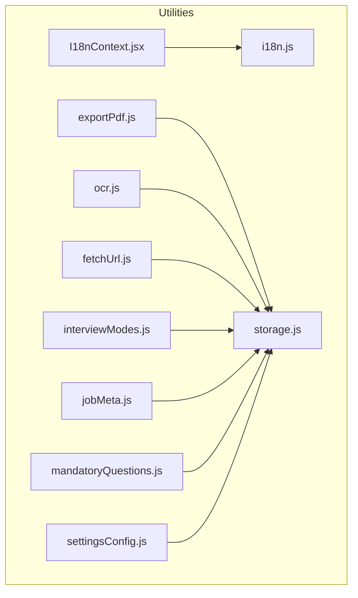
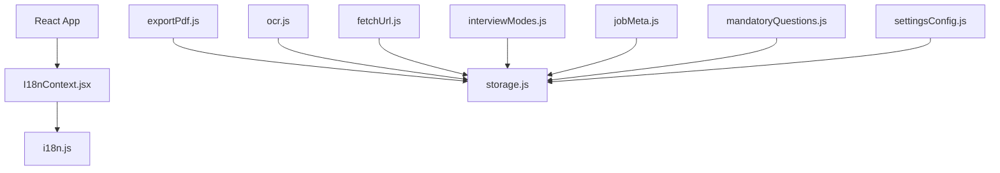
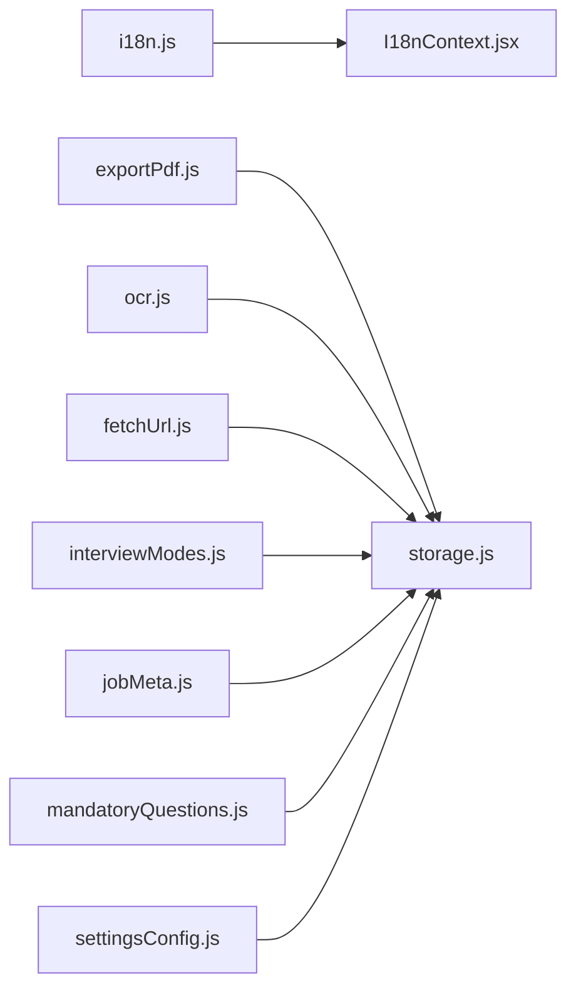

# Utility Libraries

<cite>
**Referenced Files in This Document**
- [I18nContext.jsx](file://src/lib/I18nContext.jsx)
- [i18n.js](file://src/lib/i18n.js)
- [storage.js](file://src/lib/storage.js)
- [exportPdf.js](file://src/lib/exportPdf.js)
- [ocr.js](file://src/lib/ocr.js)
- [fetchUrl.js](file://src/lib/fetchUrl.js)
- [interviewModes.js](file://src/lib/interviewModes.js)
- [jobMeta.js](file://src/lib/jobMeta.js)
- [mandatoryQuestions.js](file://src/lib/mandatoryQuestions.js)
- [settingsConfig.js](file://src/lib/settingsConfig.js)
</cite>

## Table of Contents
1. [Introduction](#introduction)
2. [Project Structure](#project-structure)
3. [Core Components](#core-components)
4. [Architecture Overview](#architecture-overview)
5. [Detailed Component Analysis](#detailed-component-analysis)
6. [Dependency Analysis](#dependency-analysis)
7. [Performance Considerations](#performance-considerations)
8. [Troubleshooting Guide](#troubleshooting-guide)
9. [Conclusion](#conclusion)

## Introduction
This document provides comprehensive documentation for LineCheck’s utility libraries and helper modules located under src/lib. It covers internationalization (i18n), storage management, PDF export, OCR processing, URL fetching utilities, interview modes configuration, job metadata handling, mandatory questions management, and settings configuration. For each module, you will find API surface descriptions, configuration options, usage patterns, integration examples, error handling strategies, performance considerations, and best practices for extending functionality.

## Project Structure
The utility libraries are organized by feature area within src/lib:
- Internationalization: i18n.js, I18nContext.jsx
- Storage: storage.js
- Export: exportPdf.js
- OCR: ocr.js
- Networking: fetchUrl.js
- Configuration: interviewModes.js, jobMeta.js, mandatoryQuestions.js, settingsConfig.js

[No sources needed since this diagram shows conceptual structure]

## Core Components
This section summarizes the purpose and responsibilities of each utility module.

- Internationalization (i18n): Provides language switching, message resolution, and React context integration for UI components to render localized text.
- Storage: Encapsulates persistent key-value operations with safe defaults and error handling.
- PDF Export: Generates printable or downloadable documents from application data.
- OCR: Extracts text from images or scanned content using browser APIs or external services.
- URL Fetching: Centralized HTTP client with retries, timeouts, and error normalization.
- Interview Modes: Defines available interview configurations and their behavior.
- Job Metadata: Parses and normalizes job-related information for consistent use across features.
- Mandatory Questions: Manages required questions and validation rules.
- Settings Configuration: Centralizes app-wide settings schema, defaults, and persistence.

**Section sources**
- [i18n.js](file://src/lib/i18n.js)
- [I18nContext.jsx](file://src/lib/I18nContext.jsx)
- [storage.js](file://src/lib/storage.js)
- [exportPdf.js](file://src/lib/exportPdf.js)
- [ocr.js](file://src/lib/ocr.js)
- [fetchUrl.js](file://src/lib/fetchUrl.js)
- [interviewModes.js](file://src/lib/interviewModes.js)
- [jobMeta.js](file://src/lib/jobMeta.js)
- [mandatoryQuestions.js](file://src/lib/mandatoryQuestions.js)
- [settingsConfig.js](file://src/lib/settingsConfig.js)

## Architecture Overview
The utilities follow a modular design with clear separation of concerns:
- i18n is provided via a React context for declarative localization in components.
- Storage acts as a shared persistence layer used by multiple utilities.
- Feature-specific modules (PDF export, OCR, URL fetching, settings, etc.) depend on storage and expose focused APIs.

**Diagram sources**
- [I18nContext.jsx](file://src/lib/I18nContext.jsx)
- [i18n.js](file://src/lib/i18n.js)
- [storage.js](file://src/lib/storage.js)
- [exportPdf.js](file://src/lib/exportPdf.js)
- [ocr.js](file://src/lib/ocr.js)
- [fetchUrl.js](file://src/lib/fetchUrl.js)
- [interviewModes.js](file://src/lib/interviewModes.js)
- [jobMeta.js](file://src/lib/jobMeta.js)
- [mandatoryQuestions.js](file://src/lib/mandatoryQuestions.js)
- [settingsConfig.js](file://src/lib/settingsConfig.js)

## Detailed Component Analysis

### Internationalization (i18n)
Purpose:
- Provide a centralized dictionary and runtime language switching.
- Expose a React context so components can consume localized strings without prop drilling.

API Surface:
- Language registry and message map initialization.
- Function to set current locale and resolve messages by keys.
- React context provider exposing t-like function and current language state.

Configuration Options:
- Default locale selection.
- Locale fallback strategy when keys are missing.
- Optional pluralization or interpolation support if implemented.

Usage Patterns:
- Wrap application root with the i18n provider.
- Consume translation function in components via context hooks.
- Dynamically switch languages at runtime.

Integration Example:
- Initialize provider in main entry point.
- Use translation hook in page components to render dynamic labels.

Error Handling:
- Graceful fallback to default locale or raw key when translations are missing.
- Warn on undefined keys during development.

Performance Considerations:
- Memoize resolved messages where possible.
- Avoid heavy computations inside translation calls; precompute or cache results.

Best Practices:
- Keep message keys stable and descriptive.
- Centralize all user-facing strings in the i18n dictionary.
- Test both default and alternate locales early.

**Section sources**
- [i18n.js](file://src/lib/i18n.js)
- [I18nContext.jsx](file://src/lib/I18nContext.jsx)

### Storage Management
Purpose:
- Abstract persistent storage operations with safe defaults and robust error handling.

API Surface:
- get(key, defaultValue)
- set(key, value)
- remove(key)
- clear()
- Keys enumeration helpers if implemented.

Configuration Options:
- Storage backend selection (e.g., localStorage vs sessionStorage).
- Serialization/deserialization strategies for complex types.

Usage Patterns:
- Read settings with defaults.
- Persist user preferences and temporary states.
- Batch updates when appropriate.

Integration Example:
- Load initial settings from storage on app start.
- Save updated settings after user changes.

Error Handling:
- Catch quota exceeded or security errors.
- Return defaults on failure and log warnings.

Performance Considerations:
- Minimize synchronous writes; debounce frequent updates.
- Serialize only necessary fields.

Best Practices:
- Define typed keys and constants.
- Validate values before persisting.
- Provide migration helpers for schema evolution.

**Section sources**
- [storage.js](file://src/lib/storage.js)

### PDF Export
Purpose:
- Convert application data into a printable or downloadable PDF document.

API Surface:
- generatePdf(data, options)
- printPdf(htmlOrElement, options)
- Helpers for formatting tables, lists, and headers.

Configuration Options:
- Page size, margins, orientation.
- Header/footer templates.
- Styling overrides.

Usage Patterns:
- Build structured data model for export.
- Render HTML template then convert to PDF.
- Trigger download or print dialog.

Integration Example:
- Export interview summary or candidate report.

Error Handling:
- Handle large payloads gracefully.
- Fallback to print view if PDF generation fails.

Performance Considerations:
- Stream or chunk large content.
- Optimize CSS for print/PDF rendering.

Best Practices:
- Keep exported content semantic and accessible.
- Provide preview before finalizing export.

**Section sources**
- [exportPdf.js](file://src/lib/exportPdf.js)

### OCR Processing
Purpose:
- Extract text from images or scanned documents using browser-native APIs or external services.

API Surface:
- extractText(imageSource, options)
- preprocessImage(imageData, filters)
- Recognize batched images with progress callbacks.

Configuration Options:
- Source type (canvas, file, blob, base64).
- Image preprocessing steps (resize, contrast, grayscale).
- Service endpoint or library selection.

Usage Patterns:
- Capture image input.
- Preprocess to improve accuracy.
- Run OCR and return recognized text.

Integration Example:
- Process uploaded resume scans or screenshots.

Error Handling:
- Detect unsupported environments and provide graceful degradation.
- Normalize network or service errors.

Performance Considerations:
- Downscale images before OCR.
- Cache intermediate results when applicable.

Best Practices:
- Provide user feedback during long-running OCR tasks.
- Allow manual correction of recognized text.

**Section sources**
- [ocr.js](file://src/lib/ocr.js)

### URL Fetching Utilities
Purpose:
- Centralize HTTP requests with standardized error handling, retries, and timeouts.

API Surface:
- fetch(url, options)
- get(url, params)
- post(url, body)
- put/delete variants if implemented.

Configuration Options:
- Global timeout and retry policy.
- Headers and authentication injection.
- Response parsing and transformation.

Usage Patterns:
- Replace ad-hoc fetch calls with the utility.
- Compose request pipelines with interceptors if present.

Integration Example:
- Fetch job listings or settings from remote endpoints.

Error Handling:
- Normalize network failures, timeouts, and non-2xx responses.
- Provide actionable error messages and codes.

Performance Considerations:
- Implement caching for idempotent GET requests.
- Debounce rapid successive calls.

Best Practices:
- Keep URLs and parameters validated.
- Log errors with correlation IDs for debugging.

**Section sources**
- [fetchUrl.js](file://src/lib/fetchUrl.js)

### Interview Modes Configuration
Purpose:
- Define available interview modes and their behaviors for consistent UX and logic.

API Surface:
- List of supported modes with identifiers and display names.
- Mode-specific options and constraints.
- Validation helpers for mode selection.

Configuration Options:
- Enable/disable modes per environment.
- Default mode selection.
- Conditional availability based on permissions or features.

Usage Patterns:
- Populate mode selectors in UI.
- Enforce valid selections before starting an interview.

Integration Example:
- Switch between standard, timed, or adaptive interview flows.

Error Handling:
- Reject invalid or deprecated modes.
- Provide fallback to default mode.

Performance Considerations:
- Lazy-load mode definitions if they are large.

Best Practices:
- Version mode schemas to support future changes.
- Document mode semantics clearly.

**Section sources**
- [interviewModes.js](file://src/lib/interviewModes.js)

### Job Metadata Handling
Purpose:
- Parse, normalize, and validate job-related metadata for consistent consumption across features.

API Surface:
- parseJob(rawData)
- normalizeFields(job)
- validate(jobSchema)
- Helpers for extracting tags, skills, and location info.

Configuration Options:
- Field mapping rules.
- Required vs optional fields.
- Localization of labels.

Usage Patterns:
- Ingest raw job postings and transform into canonical form.
- Feed normalized data into search, recommendations, and exports.

Integration Example:
- Display enriched job details and filter candidates accordingly.

Error Handling:
- Coerce malformed fields to safe defaults.
- Report validation errors with field paths.

Performance Considerations:
- Cache parsed results keyed by job ID.
- Avoid redundant transformations.

Best Practices:
- Maintain backward compatibility for older job formats.
- Keep normalization logic deterministic.

**Section sources**
- [jobMeta.js](file://src/lib/jobMeta.js)

### Mandatory Questions Management
Purpose:
- Manage required questions and associated validation rules for interviews or forms.

API Surface:
- listMandatory()
- addQuestion(questionDef)
- removeQuestion(id)
- validateAnswers(answers, rules)

Configuration Options:
- Question categories and dependencies.
- Dynamic rule evaluation.
- Localization of question text and hints.

Usage Patterns:
- Build question sets dynamically based on role or level.
- Enforce completion before submission.

Integration Example:
- Ensure critical compliance questions are answered.

Error Handling:
- Provide clear validation messages.
- Prevent submission on missing mandatory answers.

Performance Considerations:
- Precompile rules where possible.
- Avoid re-evaluating unchanged questions.

Best Practices:
- Separate question content from validation logic.
- Support versioning of question sets.

**Section sources**
- [mandatoryQuestions.js](file://src/lib/mandatoryQuestions.js)

### Settings Configuration
Purpose:
- Centralize application-wide settings with schema, defaults, and persistence.

API Surface:
- loadSettings()
- updateSettings(partial)
- resetToDefaults()
- subscribe(listener) if reactive.

Configuration Options:
- Schema definition with types and constraints.
- Environment-specific overrides.
- Migration helpers for schema changes.

Usage Patterns:
- Initialize settings on startup.
- Update settings reactively in UI.
- Persist changes immediately or on save.

Integration Example:
- Persist theme, language, and feature flags.

Error Handling:
- Validate partial updates against schema.
- Roll back on invalid changes.

Performance Considerations:
- Debounce frequent updates.
- Minimize re-renders by selective subscriptions.

Best Practices:
- Keep settings small and focused.
- Document all keys and their effects.

**Section sources**
- [settingsConfig.js](file://src/lib/settingsConfig.js)

## Dependency Analysis
The utilities have minimal coupling:
- i18n depends only on its own dictionary and context.
- Most other utilities depend on storage for persistence.
- Feature modules remain independent of each other to promote reuse.

**Diagram sources**
- [i18n.js](file://src/lib/i18n.js)
- [I18nContext.jsx](file://src/lib/I18nContext.jsx)
- [storage.js](file://src/lib/storage.js)
- [exportPdf.js](file://src/lib/exportPdf.js)
- [ocr.js](file://src/lib/ocr.js)
- [fetchUrl.js](file://src/lib/fetchUrl.js)
- [interviewModes.js](file://src/lib/interviewModes.js)
- [jobMeta.js](file://src/lib/jobMeta.js)
- [mandatoryQuestions.js](file://src/lib/mandatoryQuestions.js)
- [settingsConfig.js](file://src/lib/settingsConfig.js)

**Section sources**
- [storage.js](file://src/lib/storage.js)
- [i18n.js](file://src/lib/i18n.js)
- [I18nContext.jsx](file://src/lib/I18nContext.jsx)
- [exportPdf.js](file://src/lib/exportPdf.js)
- [ocr.js](file://src/lib/ocr.js)
- [fetchUrl.js](file://src/lib/fetchUrl.js)
- [interviewModes.js](file://src/lib/interviewModes.js)
- [jobMeta.js](file://src/lib/jobMeta.js)
- [mandatoryQuestions.js](file://src/lib/mandatoryQuestions.js)
- [settingsConfig.js](file://src/lib/settingsConfig.js)

## Performance Considerations
- Prefer memoization and caching for expensive operations like OCR and PDF generation.
- Debounce frequent storage writes to avoid blocking the UI thread.
- Use streaming or pagination for large datasets in URL fetching.
- Keep i18n dictionaries lean and lazy-load locales if needed.
- Normalize and cache job metadata to reduce repeated parsing.

[No sources needed since this section provides general guidance]

## Troubleshooting Guide
Common issues and resolutions:
- Missing translations: Ensure keys exist in the dictionary and fallbacks are configured.
- Storage quota exceeded: Clear unused keys or migrate to IndexedDB if necessary.
- PDF generation failures: Reduce payload size and simplify styles; fall back to print view.
- OCR inaccuracies: Improve image preprocessing and consider alternative engines.
- Network errors: Check timeouts, retries, and server status; inspect normalized error codes.
- Invalid settings: Validate against schema and roll back on errors.

**Section sources**
- [i18n.js](file://src/lib/i18n.js)
- [storage.js](file://src/lib/storage.js)
- [exportPdf.js](file://src/lib/exportPdf.js)
- [ocr.js](file://src/lib/ocr.js)
- [fetchUrl.js](file://src/lib/fetchUrl.js)
- [settingsConfig.js](file://src/lib/settingsConfig.js)

## Conclusion
LineCheck’s utility libraries provide a cohesive foundation for internationalization, persistence, content processing, networking, and configuration. By following the recommended patterns, error handling strategies, and performance optimizations, teams can extend functionality safely and maintain high reliability across features.

[No sources needed since this section summarizes without analyzing specific files]